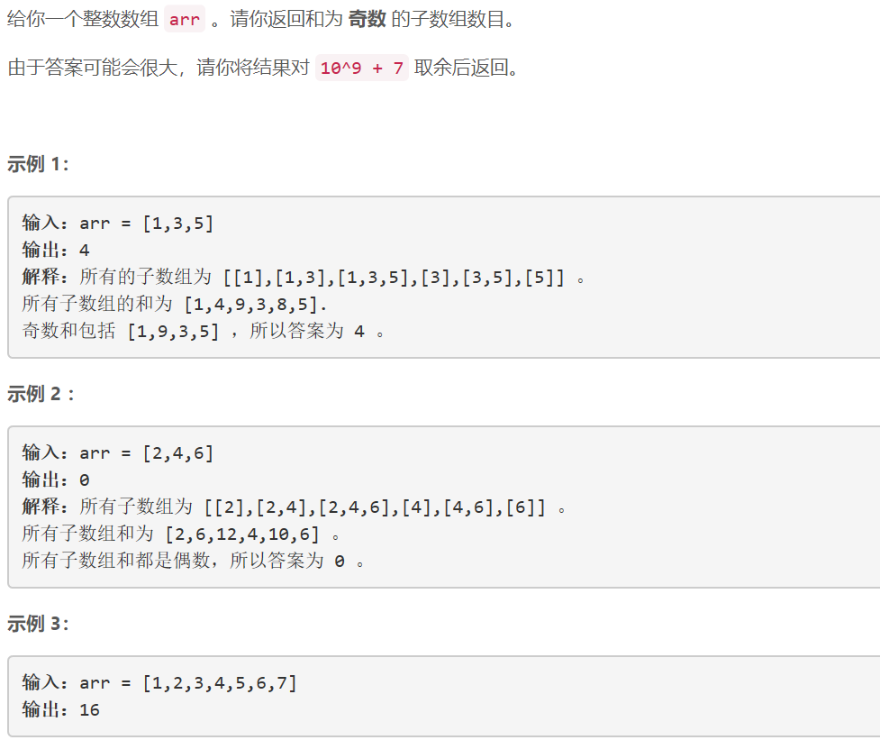
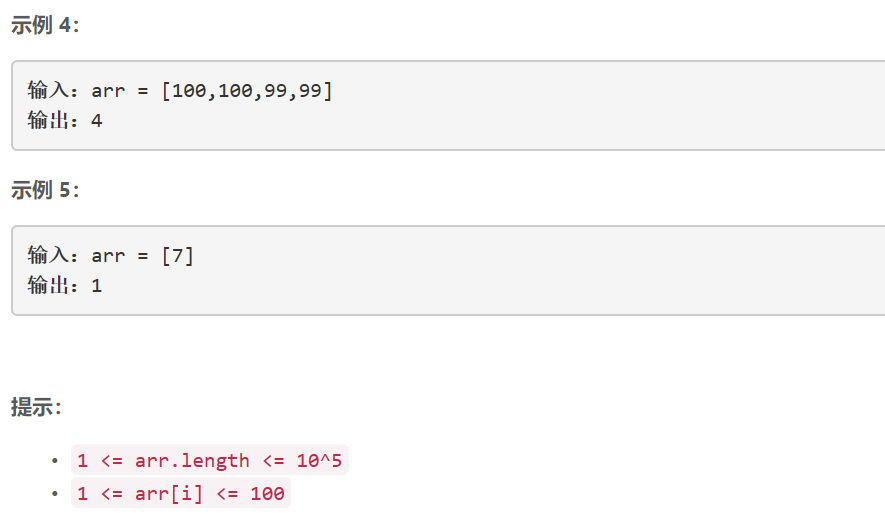

### 5457. 和为奇数的子数组数目


    

  


## Java solution
```java
class Solution {
    int mod=(int)1e9+7;
    public int numOfSubarrays(int[] arr) {
       int n=arr.length;
       int[] dp1=new int[n+1];//包括arr[i-1]的和为偶数的子数组数目
       int[] dp2=new int[n+1];//包括arr[i-1]的和为奇数的子数组数目
       int res=0; 
       for(int i=0;i<n;i++)
       {
          if(arr[i]%2==0)
          {
              dp1[i+1]=(dp1[i]+1)%mod;
              dp2[i+1]=dp2[i];
          }
          else
          {
              dp1[i+1]=dp2[i];
              dp2[i+1]=(dp1[i]+1)%mod;
             
          }
           res=(res+dp2[i+1])%mod;
       } 
       return res; 
    }
}
```