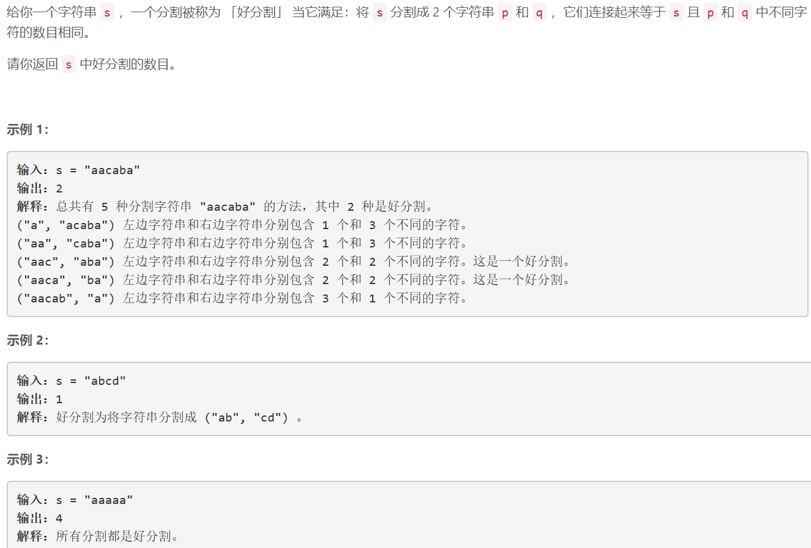
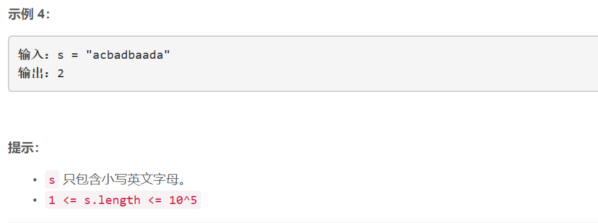

### 5458. 字符串的好分割数目


  

    

## Java solution

```java
class Solution {
    public int numSplits(String s) {
        int res=0;
        int n=s.length();
        int[] cnt=new int[26];
        int[] dp1=new int[n];
        int[] dp2=new int[n];
        dp1[0]=1;
        cnt[(int)(s.charAt(0)-'a')]=1;
        for(int i=1;i<n;i++)
        {
            int idx=(int)(s.charAt(i)-'a');
            dp1[i]=cnt[idx]==0?dp1[i-1]+1:dp1[i-1];
            cnt[idx]++;
        }
        cnt=new int[26];
        dp2[n-1]=1;
        cnt[(int)(s.charAt(n-1)-'a')]=1;
        for(int i=n-2;i>=0;i--)
        {
            int idx=(int)(s.charAt(i)-'a');
            dp2[i]=cnt[idx]==0?dp2[i+1]+1:dp2[i+1];
            cnt[idx]++;
        }
        for(int i=0;i<n-1;i++)
        {
            if(dp1[i]==dp2[i+1])res++;
        }
        return res;
    }
}
```