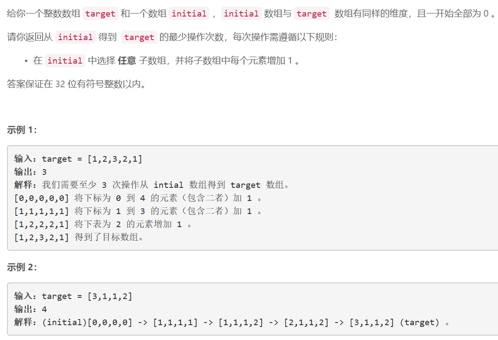

### 5459. 形成目标数组的子数组最少增加次数

  


## Java solution
```java
class Solution {
    public int minNumberOperations(int[] target) {
        int cnt=target[0],n=target.length;
        for(int i=1;i<n;i++)
        {
            cnt+=Math.max(target[i]-target[i-1],0);//只有升序的天数需要考虑(降序的天数已经算在升序天数之内) 选择子数组限制了每个升序序列不许单独计算
        }
        return cnt;
    }
}
```

