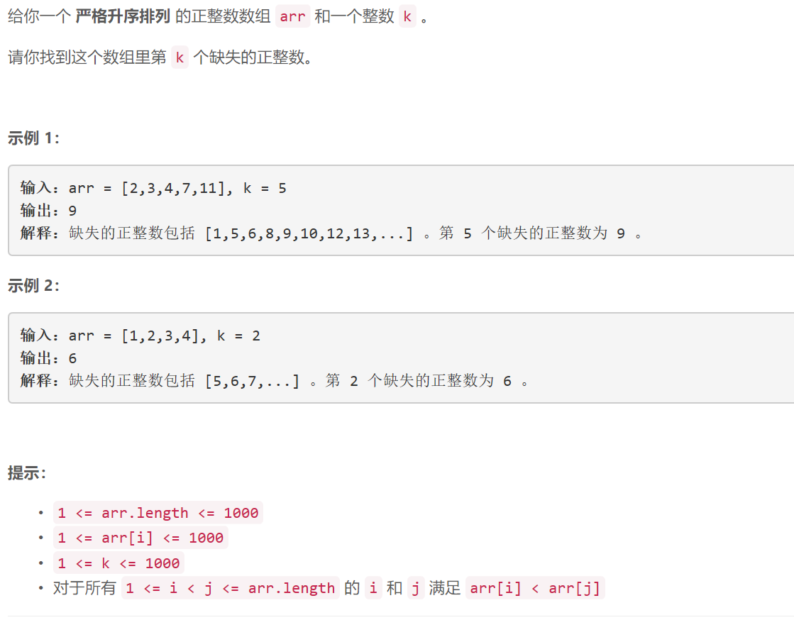

### 5468. 第 k 个缺失的正整数

### 


## Java solution
```java
class Solution {
    public int findKthPositive(int[] arr, int k) {
         int cnt=0;
         int[] dp=new int[2005];
         for(int i=0;i<arr.length;i++)dp[arr[i]]++;
         for(int i=1;i<=2005;i++)
         {
             if(dp[i]==0)cnt++;
             if(cnt==k)return i;
         }
         return -1;
    }
}
```


