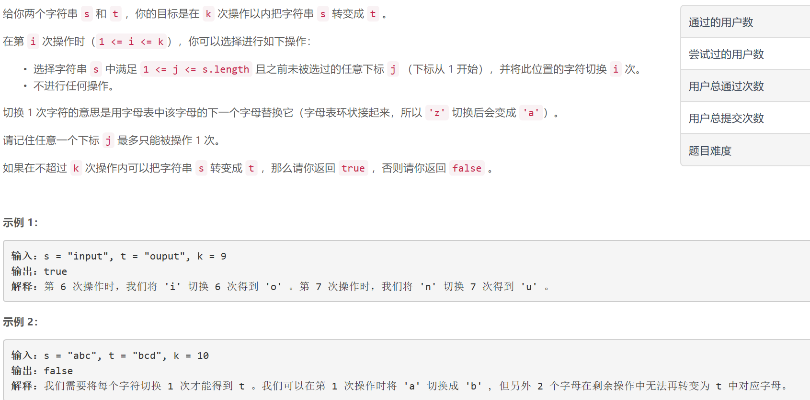
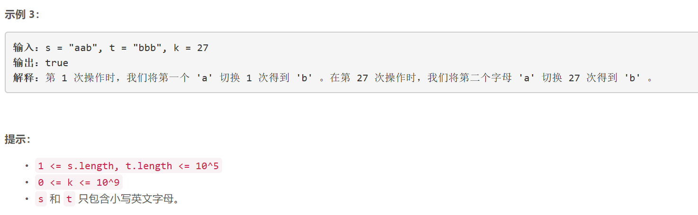

### 5457. 和为奇数的子数组数目


    

  


## Java solution
```java
class Solution {
    public boolean canConvertString(String s, String t, int k) {
           int n1=s.length(),n2=t.length();
           if(n1!=n2)return false;
           int n=n1;
           int[] dp=new int[26];
           for(int i=0;i<n;i++)
           {
               char c1=s.charAt(i);
               char c2=t.charAt(i);
               if(c1==c2)continue;
               else
               {
                   int time=((int)(c2-c1)+26)%26;
                   dp[time]=dp[time]==0?time:dp[time]+26;
                   if(dp[time]>k)return false; 
               }
           }
           return true;
    }
}
```