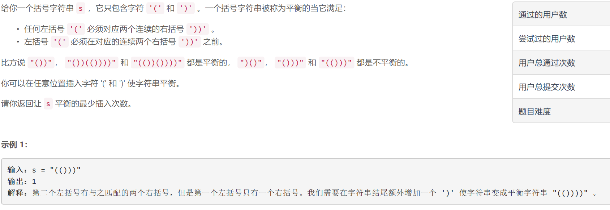
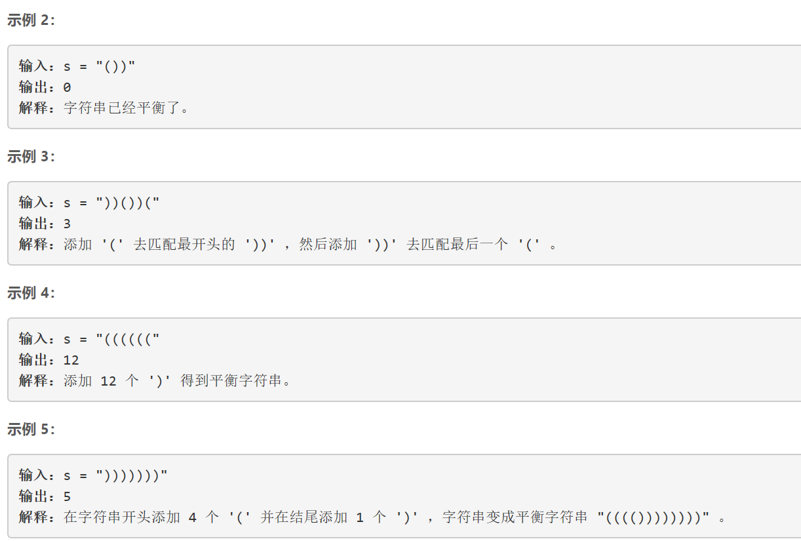
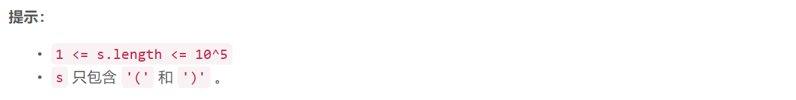

### 5470. 平衡括号字符串的最少插入次数


  

    



## Java solution

```java
class Solution {
    public int minInsertions(String s) {
       int cnt=0;
       int res=0;
       int i=0,n=s.length();
       while(i<n)
       {
           char c=s.charAt(i);
           if(c=='(')
           {
               cnt++;
               i++;
           }
           else
           {
               if(i<n-1&&s.charAt(i+1)==')')
               {
                   if(cnt>0)cnt--;
                   else
                   {
                       res+=1;
                   }                  
                   i+=2;
               }
               else
               {
                   if(cnt>0)
                   {
                       cnt--;
                       res+=1;
                   }
                   else
                   {
                       res+=2;
                   }                  
                   i+=1;
               }
           }
           
       }
       res+=cnt*2; 
       return res; 
    }
}
```