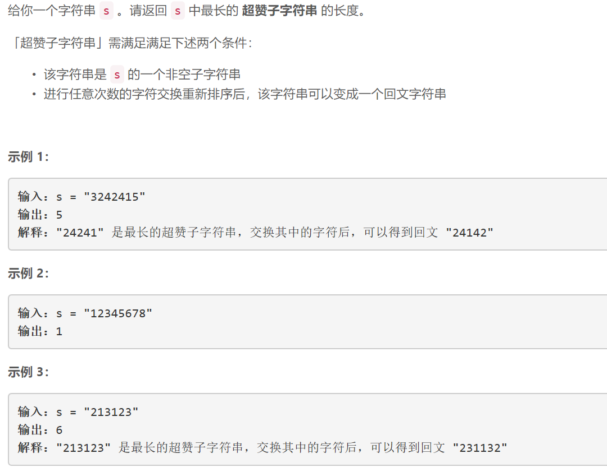
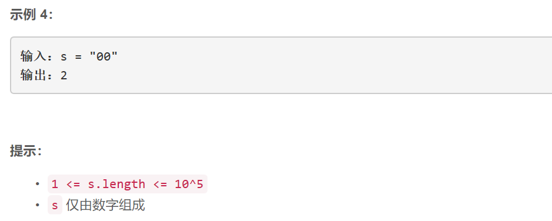

### 5485. 找出最长的超赞子字符串

  




## Java solution
```java
class Solution {
      /*
    如果status2和status1相同，那么区间(map.get(status1),map.get(status2)]中所有数字都出现了偶数次，满足超赞的条件。
如果status2和status1只差一位不同，那么区间(map.get(status1),map.get(status2)]中有一个数字出现了奇数次，其余数字都出现了偶数次，满足超赞的条件。
    */
    public int longestAwesome(String s) {
       int[] map=new int[1<<10+5];
       Arrays.fill(map,-2);
       int res=1,state=0;//state的第i位为1 说明出现奇数次i 第j位为0说明出现偶数次i
       map[0]=-1;
       for(int i=0;i<s.length();i++)
       {
           int num=(int)(s.charAt(i)-'0');
           state^=(1<<num);//将state的第num位取反 
           for(int j=0;j<10;j++)
           {
               if(map[state^(1<<j)]!=-2)
               {
                   res=Math.max(res,i-map[state^(1<<j)]);//区间是左开右闭的
               }
           }
           if(map[state]==-2)map[state]=i;
           else res=Math.max(res,i-map[state]);
       }
       return res;
    }
}
```

