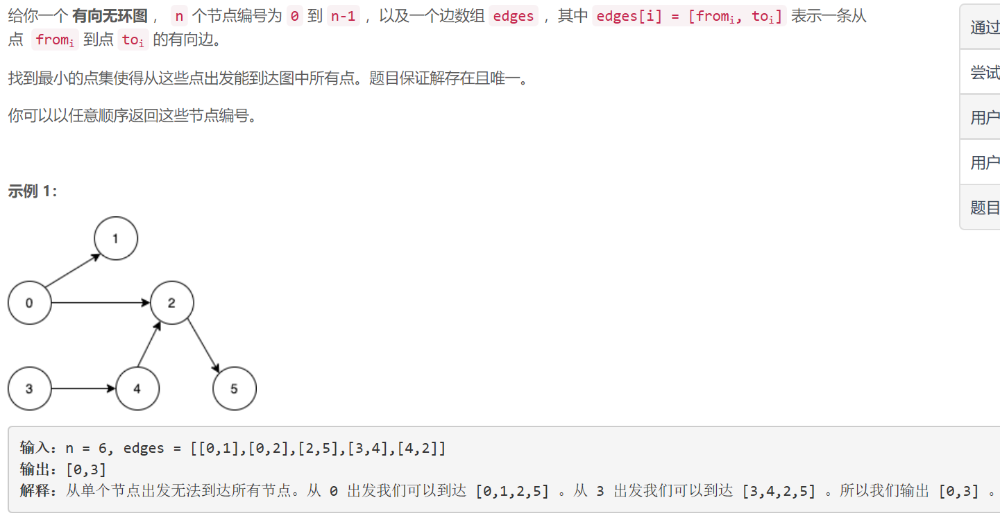
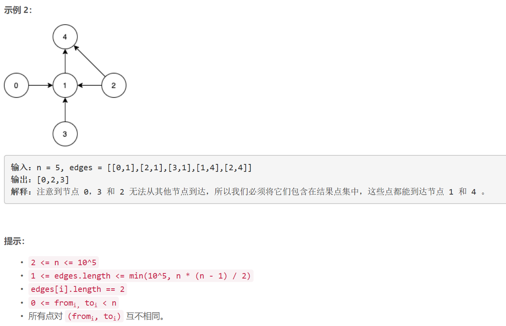

### 5480. 可以到达所有点的最少点数目


    

  


## Java solution
```java
class Solution {
    public List<Integer> findSmallestSetOfVertices(int n, List<List<Integer>> edges) {
            boolean[] dp=new boolean[n];
            for(List<Integer> e:edges)
            {
                dp[e.get(1)]=true;
            }
             List<Integer> res=new ArrayList<>();
            for(int i=0;i<n;i++)if(!dp[i])res.add(i);
             return res;
    }
}
```