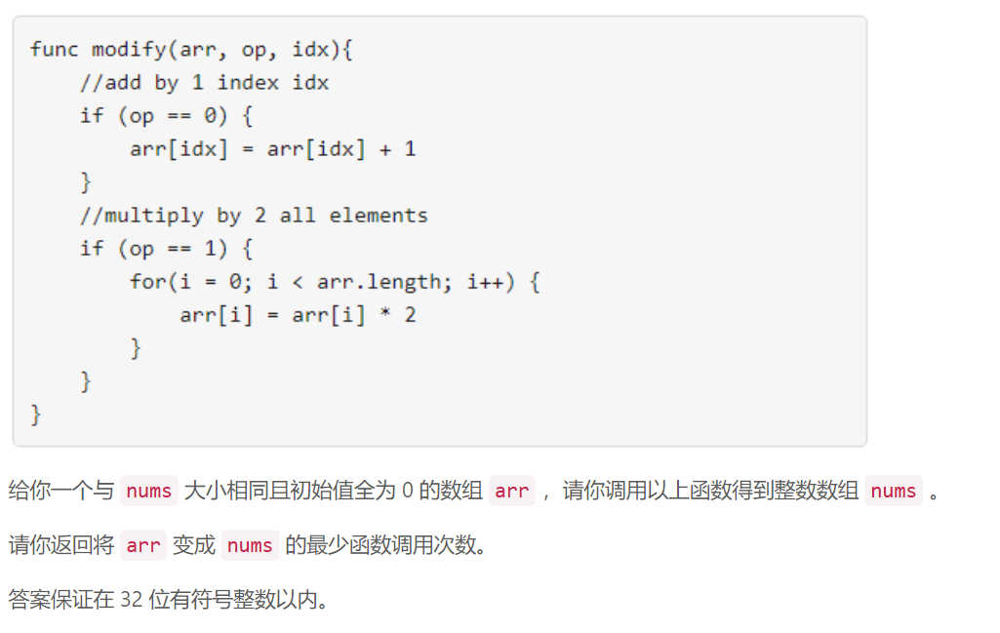
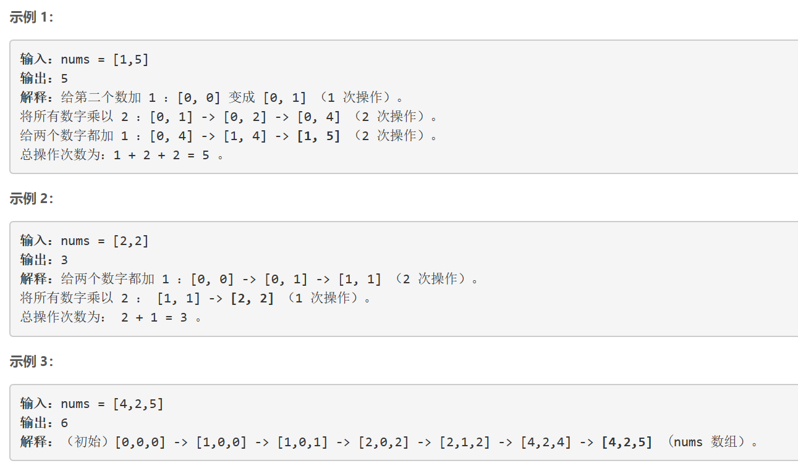
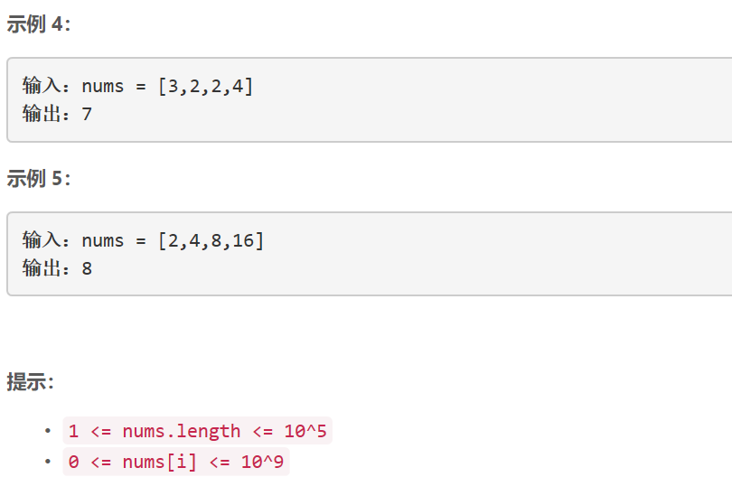

### 5481. 得到目标数组的最少函数调用次数

  






## Java solution
```java
class Solution {
    public int minOperations(int[] nums) {
        //int n=nums.length;
        int plus1=0,times2=0;
        //boolean[] dp=new boolean[31];
        for(int n:nums)
        {
            int bit=0;
            int onecnt=0;
            int original=n;
            while(n!=0)
            {
                if(n%2==1)onecnt++;
                n>>=1;
                bit++;
            }
            times2=Math.max(bit-1,times2);//最多需要乘2的次数是num位数-1
            plus1+=onecnt;//每个数都要加num中1的个数个1
        }
        return times2+plus1;
    }
}
```

