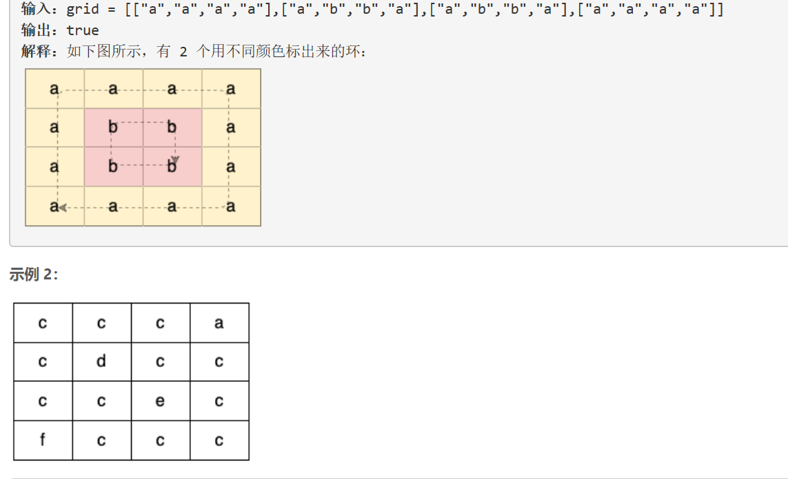
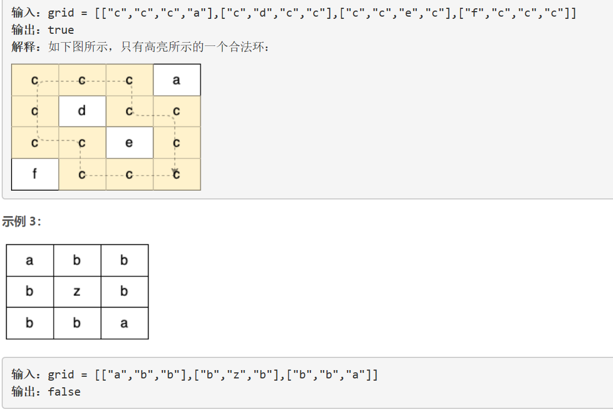
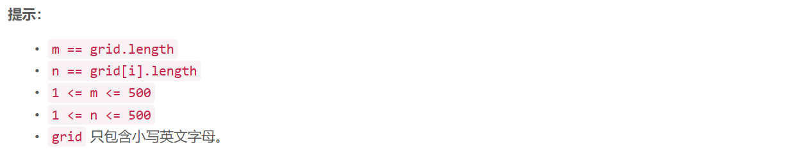

### 5482. 二维网格图中探测环


  

    





## Java solution

```java
class Solution {
    boolean[][] visited;
    boolean res=false;
    int[] d={1,0,-1,0,1};
    public boolean containsCycle(char[][] grid) {
       int m=grid.length,n=grid[0].length;
       visited=new boolean[m][n];
        for(int i=0;i<m;i++)for(int j=0;j<n;j++)
        {
            if(!visited[i][j])dfs(grid,grid[i][j],i,j,-1,-1);
            if(res) return true;
        }
        return false;
    }
    private void dfs(char[][] grid,char c,int x,int y,int prev_x,int prev_y)
    {
        int m=grid.length,n=grid[0].length;
        if(x<0 || x>=m || y<0 || y>=n ||grid[x][y]!=c) return;
        if(res) return;
        if(visited[x][y]) 
        {
            res=true;
            return ;
        }
        visited[x][y]=true;
        for(int i=0;i<4;i++)
        {
            int dx=d[i];
            int dy=d[i+1];
            int next_x=dx+x;
            int next_y=dy+y;
            if(next_x==prev_x && next_y==prev_y) continue;//下一步不能是前一步走来的位置
            dfs(grid,c,next_x,next_y,x,y);
        }
    }   
}
```