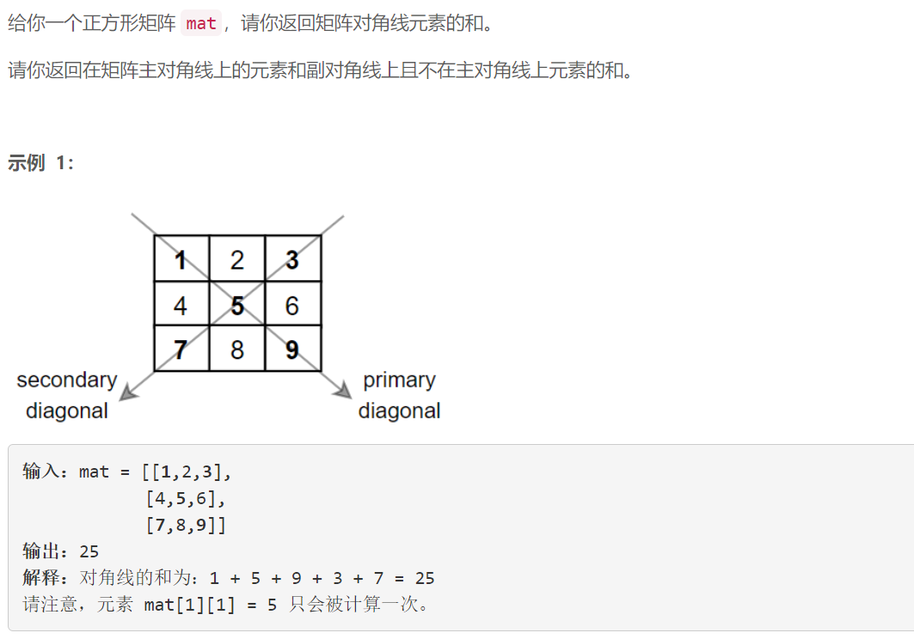
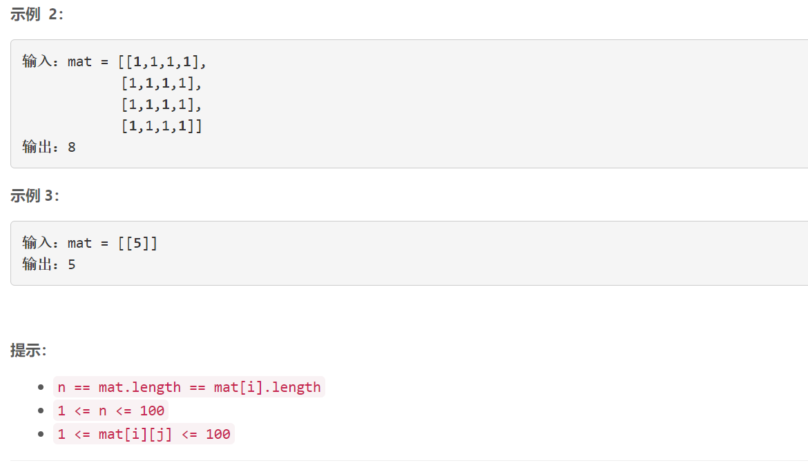

### 5491. 矩阵对角线元素的和

### 



## Java solution

```java
class Solution {
    public int diagonalSum(int[][] mat) {
         return helper(mat,0,mat.length);
    }
    private int helper(int[][] mat,int i,int n)
    {
        if(n==0)return 0;
        if(n==1)return mat[i][i];
        int sum=mat[i][i]+mat[i+n-1][i+n-1]+mat[i][i+n-1]+mat[i+n-1][i];
        return sum+helper(mat,i+1,n-2);
    }
}
```


