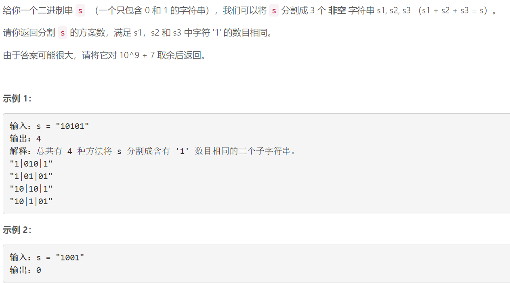
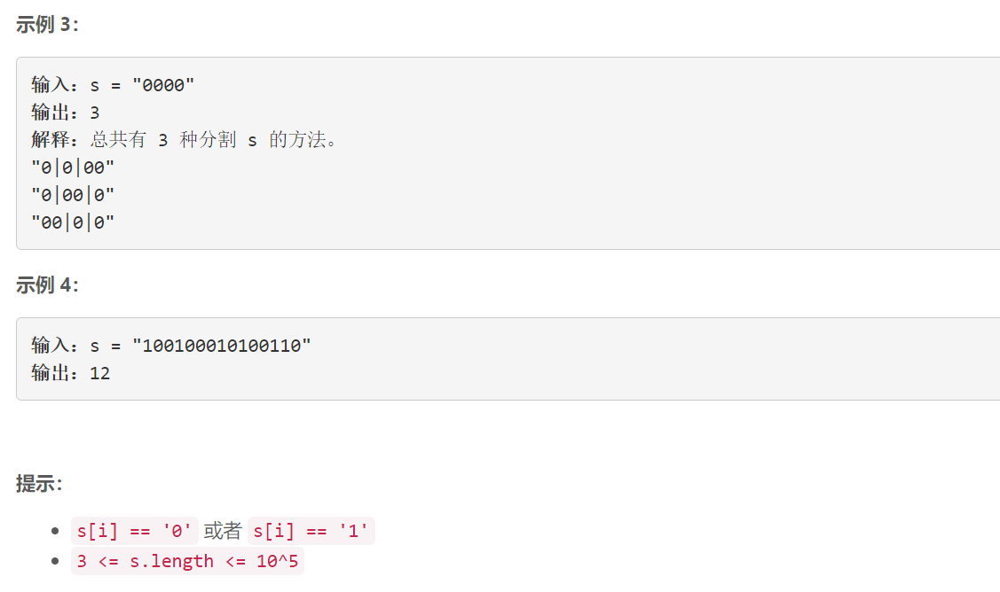

### 5492. 分割字符串的方案数


    

  


## Java solution
```java
class Solution {
    long mod=(long)1e9+7;
    public int numWays(String s) {
        char[] str=s.toCharArray();
        int cnt=0;
        for(char c:str)if(c=='1')cnt++;
        int target=cnt/3;
        if(cnt%3!=0)return 0;
        int n=str.length;
        int i=0,j=n-1;
        if(target==0)
        {
            long res=(long)(n-1)*(long)(n-2)/2L;
            return (int)(res%mod);
        }
        else
        {
            int num=0;
            long zero_cnt1=0,zero_cnt2=0;
            for(;i<n&&num<target;i++)if(str[i]=='1')num++;
            for(;i<n&&str[i]=='0';i++)zero_cnt1++;
            num=0;
            for(;j>=0 && num<target;j--)if(str[j]=='1')num++;
            for(;j>=0 && str[j]=='0';j--)zero_cnt2++;
            long res=(zero_cnt1+1)*(zero_cnt2+1);
            return (int)(res%mod);
        }
    }
}
```