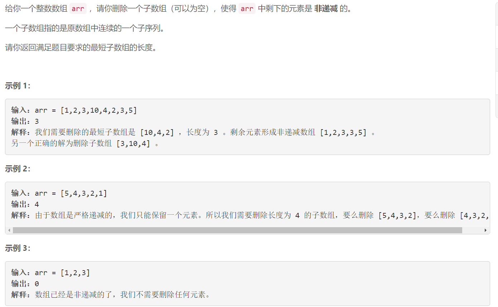
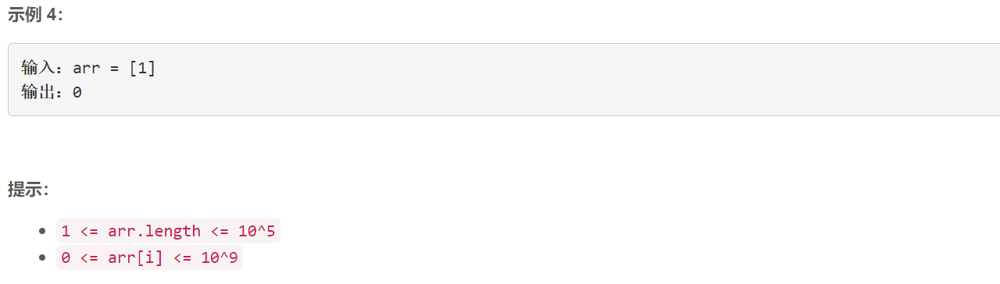

### 5493. 删除最短的子数组使剩余数组有序

  




## Java solution
```java
class Solution {
    public int findLengthOfShortestSubarray(int[] arr) {
         int n=arr.length;
         int len;//数组在去掉子数组后最长的非递减子数组长度
         int l=0,r=n-1;// [0,l] 是数组左侧有序的部分 [r,n-1]是数组右侧有序的部分
         for(;l<n-1&&arr[l]<=arr[l+1];l++);         
         if(l==n-1) return 0;//数组有序 直接返回0
         for(;r>0&&arr[r]>=arr[r-1];r--);
         len=Math.max(l+1,n-r);
         //搜索左右有序部分能够合并成为有序数组的最大长度
         for(int i=0,j=r;i<=l&&j<n;i++)
         {
             //j==n 说明数组右侧有序的部分没有比arr[i]更大的元素 所以可以跳出循环
             for(;j<n&&arr[j]<arr[i];j++);
             len=Math.max(len,i+1+n-j);
             
         }
         
        return n-len;
        
    }
}
```

