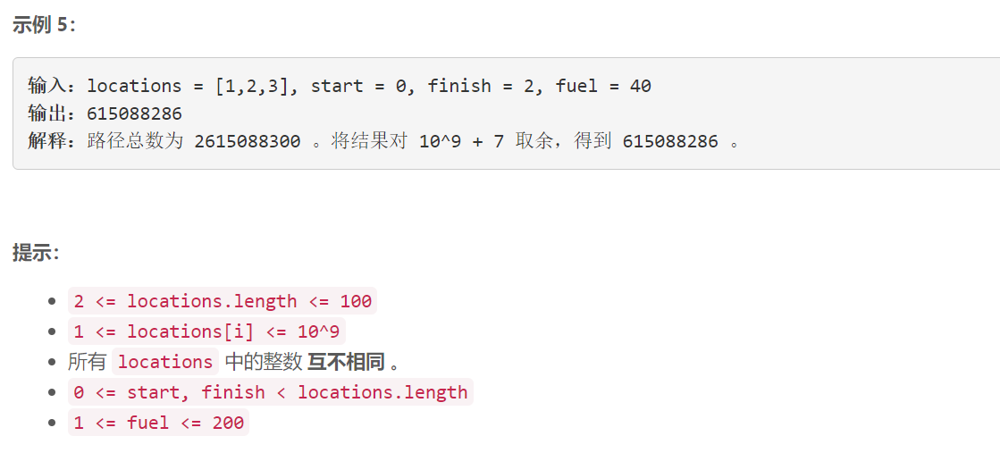

### 5494. 统计所有可行路径


  

    



## Java solution

```java
class Solution {
    int mod=(int)1e9+7;
    public int countRoutes(int[] locations, int start, int finish, int fuel) {
       int n=locations.length;
       int[][] dp=new int[n][fuel+1];//dp[i][j]表示从start开始到i 剩余汽油为j的路线数目 
       int res=0; 
       dp[start][fuel]=1; 
       for(int i=fuel;i>=0;i--)for(int j=0;j<n;j++)for(int k=0;k<n;k++)
       {
           if(j==k)continue;//从城市j到城市k 两个城市不能是同一个
           int cost=Math.abs(locations[j]-locations[k]);
           if(cost<=i)//剩余汽油不为0
           {
               dp[k][i-cost]=(dp[j][i]+dp[k][i-cost])%mod;
           }
       }
       for(int i=0;i<=fuel;i++)res=(res+dp[finish][i])%mod;
       return res;
    }
}
```