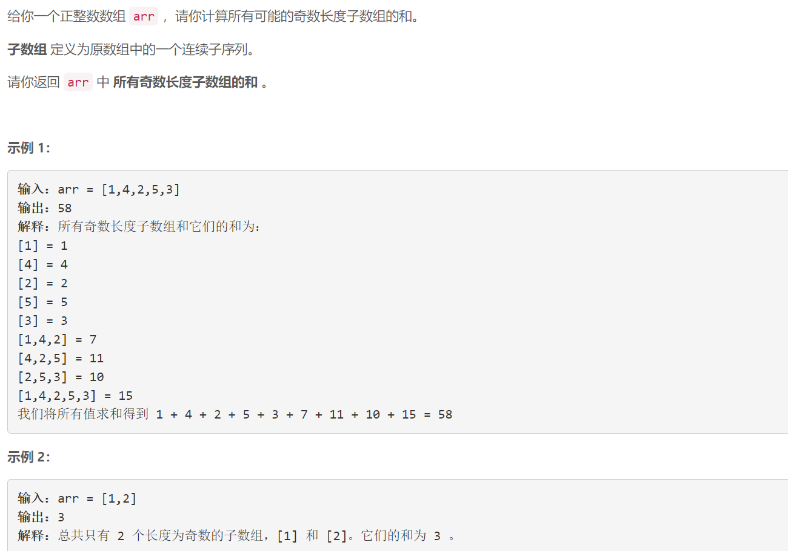
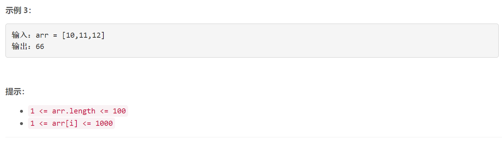

### 5503. 所有奇数长度子数组的和

### 



## Java solution

```java
class Solution {
    public int sumOddLengthSubarrays(int[] arr) {
        int res=0;
        int n=arr.length;
        for(int i=1;i<=n;i+=2)res+=helper(arr,i);
        return res;
    }
    private int helper(int[] arr,int w)
    {
        Queue<Integer> q=new LinkedList<>();
        int res=0;
        int sum=0;
        for(int i=0;i<arr.length;i++)
        {
            if(i<w)
            {
                sum+=arr[i];
            }
            else
            {
                res+=sum;
                sum-=q.poll();
                sum+=arr[i];
            }
            q.offer(arr[i]);
        }
        res+=sum;
        return res;
    }
}
```


