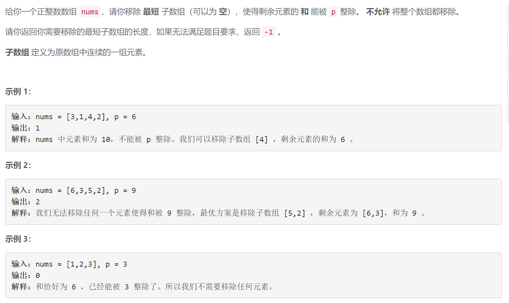
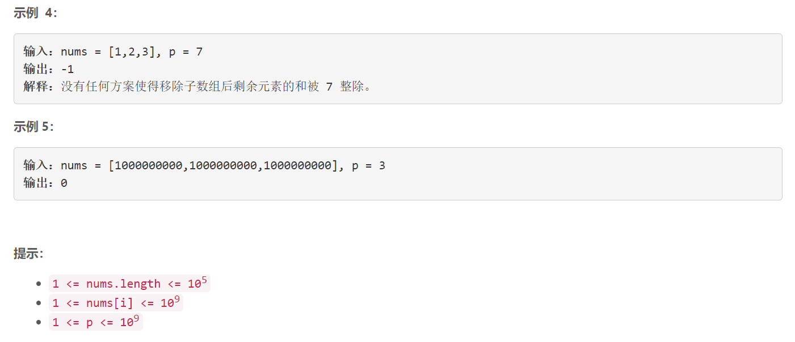

### 5504. 使数组和能被 P 整除

  




## Java solution
```java
class Solution {
   
    public int minSubarray(int[] nums, int p) {
       int n=nums.length; 
           HashMap<Integer,TreeSet<Integer>> map=new HashMap<>();
       long[] dp=new long[n+1];
        long mod=(long)p;
        TreeSet<Integer> t;
        int res=n+1; 
        //需要一个在 从右向左序列之和%p + 从左向右相加序列之和%p=p
        //把nums 分成三部分 nums[0,i]  nums(i,j) nums[j,n)  
        // sum(nums[0,i])%p+sum(nums[j,n))%p=p
       for(int i=n-1;i>=0;i--)
       {
           //dp[i] 表示从右向左相加之和 
           dp[i]=dp[i+1]+(long)nums[i];
           int key=(int)(dp[i]%mod==0?0:mod-dp[i]%mod);
           if(key==0) res=Math.min(i,res);//sum(nums[j,n))%p=0
           t=map.getOrDefault(key,new TreeSet<>());//treeset 对应某个余数对应的所有序列的索引
           t.add(i);
           map.put(key,t);
       }
       dp=new long[n+1];
       for(int i=0;i<n;i++)
       {
           dp[i+1]=dp[i]+(long)nums[i];
           int key=(int)(dp[i+1]%mod);
           if(key==0) res=Math.min(n-i-1,res);//sum(nums[0,i])%p
           if(map.containsKey(key))
           {
                t=map.get(key);    
                Integer idx=t.ceiling(i+1);//j一定大于i 也就是大于等于i+1的最小索引(这样删除的序列长度最小)
                if(idx!=null) res=Math.min(idx-i-1,res);
           }
       }
        return res==n+1?-1:res;
    }
}
```

