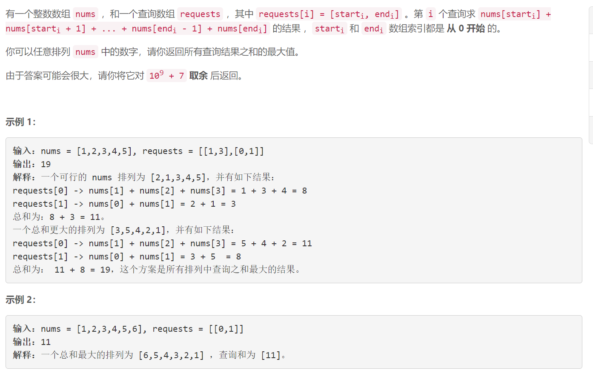
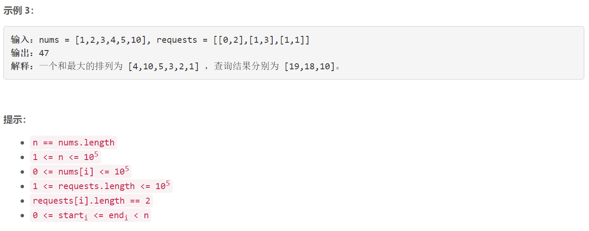

### 5505. 所有排列中的最大和


    

  


## Java solution
```java
class Solution {
    long mod=(long)1e9+7;
    //0 1 1 2 3   
    //0 1 2
    //  1 2 3
    //  1
    public int maxSumRangeQuery(int[] nums, int[][] requests) {
        int n=nums.length;
        int[] dp=new int[n];//dp[i] 表示某个排列中索引i对应元素出现的次数 出现次数越多 对应的元素值越大 这样求和结果就是最大的
        long res=0;
        for(int[] r:requests)
        {
            dp[r[0]]++;
            if(r[1]+1<n)dp[r[1]+1]--;
        }
        for(int i=1;i<n;i++)
        {
            dp[i]+=dp[i-1];
        }
        Arrays.sort(dp);
        Arrays.sort(nums);
        for(int i=n-1;i>=0 && dp[i]!=0;i--)
        {
            res+=(long)nums[i]*(long)dp[i];
        }
        return (int)(res%mod);
    }
}
```