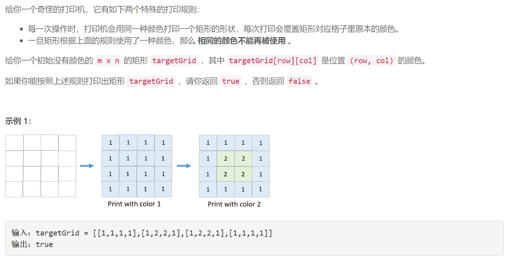
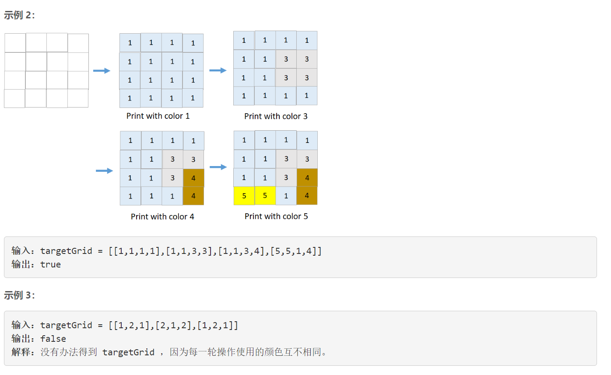
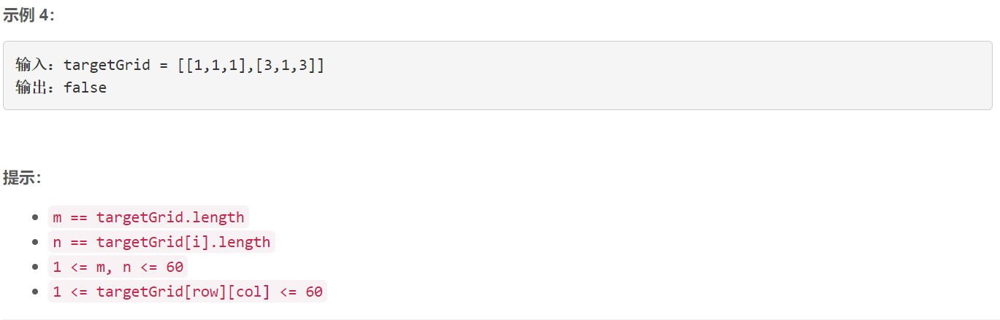

### 5506. 奇怪的打印机 II


  

    



## Java solution

```java
class Solution {
    int inf=100;
    public boolean isPrintable(int[][] targetGrid) {
        int[][] t=targetGrid;
        int m=t.length,n=t[0].length;
        boolean[] visited=new boolean[65];
         while(true)
         {
             boolean isok=true;
             for(int c=1;c<=60;c++)
             {
                 if(visited[c])continue;
                 boolean flag=true;
                 int mxx=-1,mxy=-1,mnx=inf,mny=inf;
                 for(int i=0;i<m;i++)for(int j=0;j<n;j++)
                 {
                     //确认矩形范围
                     if(t[i][j]==c)
                     {
                         mxx=Math.max(mxx,i);
                         mnx=Math.min(mnx,i);
                         mxy=Math.max(mxy,j);
                         mny=Math.min(mny,j);
                     }
                     
                     
                 }
                 if(mxx==-1)continue;//当前没有颜色c
                 for(int i=mnx;i<=mxx && flag;i++)for(int j=mny;j<=mxy && flag;j++)
                 {
                         if(t[i][j]!=c && t[i][j]!=-1)//无法构成矩形
                         {
                             flag=false;
                         }
                 }
                 if(flag)
                 {
                         for(int i=mnx;i<=mxx;i++)for(int j=mny;j<=mxy;j++) t[i][j]=-1;
                         visited[c]=true;
                         isok=false;//只要当前循环有修改当前矩形就不跳出
                 }
                 
             }
             
             if(isok) break;
             
         }
        for(int i=0;i<m;i++)for(int j=0;j<n;j++)if(t[i][j]!=-1) return false;
        return true;
    }
}
```