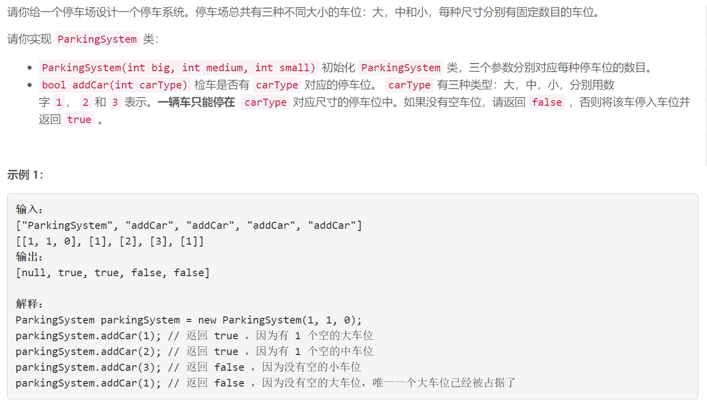

### 1603. 设计停车系统

### 


## Java solution

```java
class ParkingSystem {
     int b,m,s;
    public ParkingSystem(int big, int medium, int small) {
           b=big;
        m=medium;
        s=small;
    }
    
    public boolean addCar(int carType) {
         switch(carType)
         {
             case 1:
                 {
                     if(b==0) return false;
                     else 
                     {
                         --b;
                         return true;
                     }
                 }
                 case 2:
                 {
                     if(m==0) return false;
                     else 
                     {
                         --m;
                         return true;
                     }
                 }
                 case 3:
                 {
                     if(s==0) return false;
                     else 
                     {
                         --s;
                         return true;
                     }
                 }
         }
         return false;    
             
             
    }
}

/**
 * Your ParkingSystem object will be instantiated and called as such:
 * ParkingSystem obj = new ParkingSystem(big, medium, small);
 * boolean param_1 = obj.addCar(carType);
 */
```


