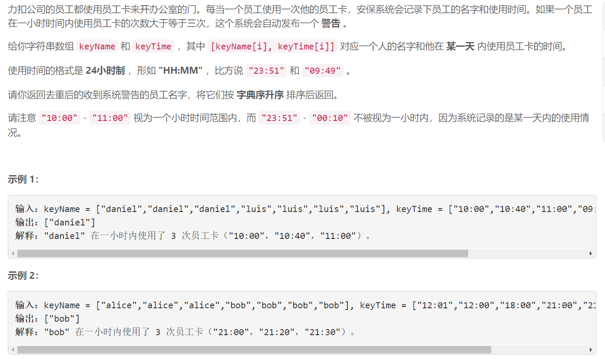
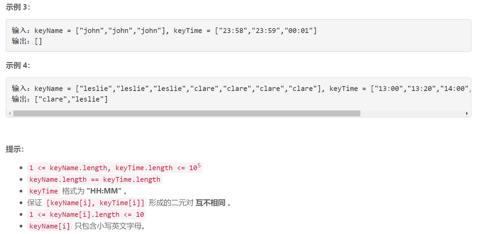

### 1604. 警告一小时内使用相同员工卡大于等于三次的人

  




## Java solution
```java
class Solution {
    public List<String> alertNames(String[] keyName, String[] keyTime) {
          HashMap<String,List<String>> map=new HashMap<>();
          int n=keyName.length;
          for(int i=0;i<n;i++)
          {
              List<String> l=map.getOrDefault(keyName[i],new ArrayList<>());
              l.add(keyTime[i]);
              map.put(keyName[i],l);
          }
        List<String> res=new ArrayList<>();
        for(String s:map.keySet())
        {
            List<String> l=map.get(s);
            Collections.sort(l);
            for(int i=2;i<l.size();i++)
            {
                if(cmp(l.get(i-2),l.get(i)))
                {
                    res.add(s);
                    break;
                }
            }
        }
        Collections.sort(res);
        return res;
    }
    private boolean cmp(String s1,String s2)
    {
        int h1=0,h2=0,m1=0,m2=0;
        int i;
        for(i=0;i<s1.length()&&s1.charAt(i)!=':';i++)h1=h1*10+(int)(s1.charAt(i)-'0');
        ++i;
        for( ;i<s1.length();i++)m1=m1*10+(int)(s1.charAt(i)-'0');
        for(i=0;i<s2.length()&&s2.charAt(i)!=':';i++)h2=h2*10+(int)(s2.charAt(i)-'0');
        ++i;
        for( ;i<s2.length();i++)m2=m2*10+(int)(s2.charAt(i)-'0');
        int t1=h1*60+m1;
        int t2=h2*60+m2;
        //System.out.print(s1+" "+s2+" "+t1+" "+t2+"\n");
        return t2>t1&&(t2-t1<=60);
    }
}
```

