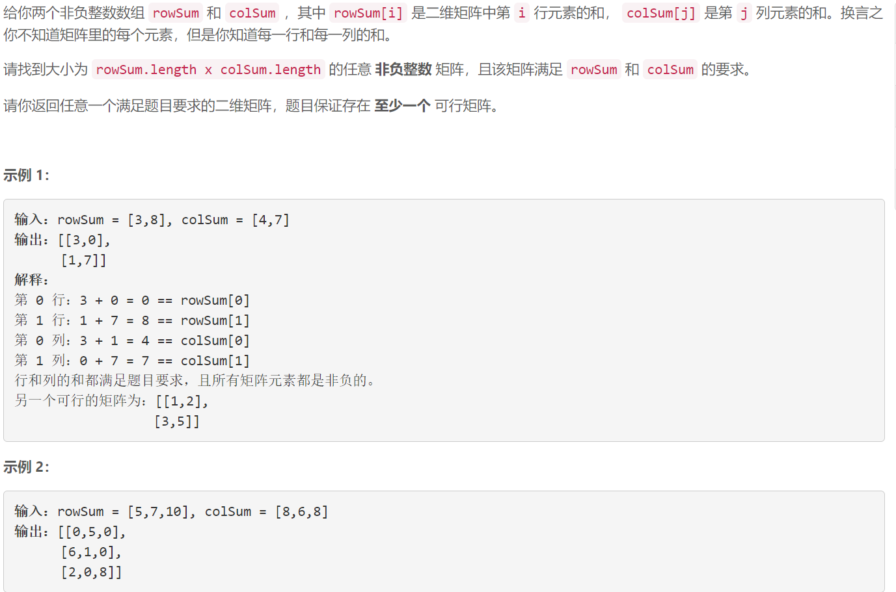
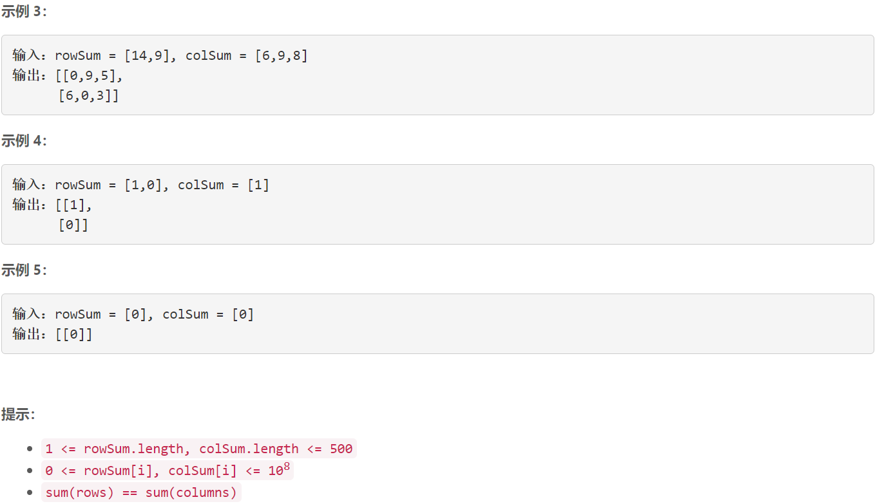

### 1605. 给定行和列的和求可行矩阵


    

  


## Java solution
```java
class Solution {
    public int[][] restoreMatrix(int[] rowSum, int[] colSum) {
       int m=rowSum.length,n=colSum.length;
       int[] r=new int[m];
       int[] c=new int[n];
       int[][] res=new int[m][n];
       for(int i=0;i<m;i++)for(int j=0;j<n;j++)
       {
           res[i][j]=Math.min(rowSum[i]-r[i],colSum[j]-c[j]);
           r[i]+=res[i][j];
           c[j]+=res[i][j];
       }
       return res;
    }
}
```