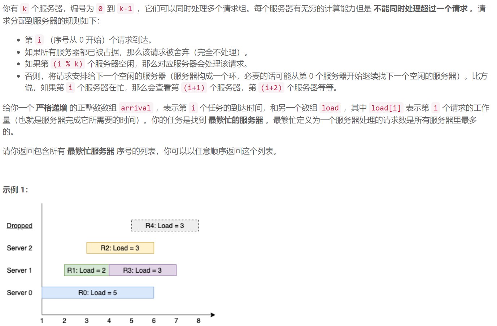
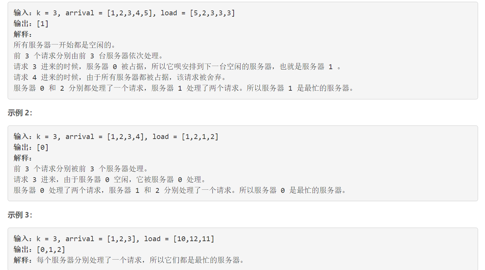
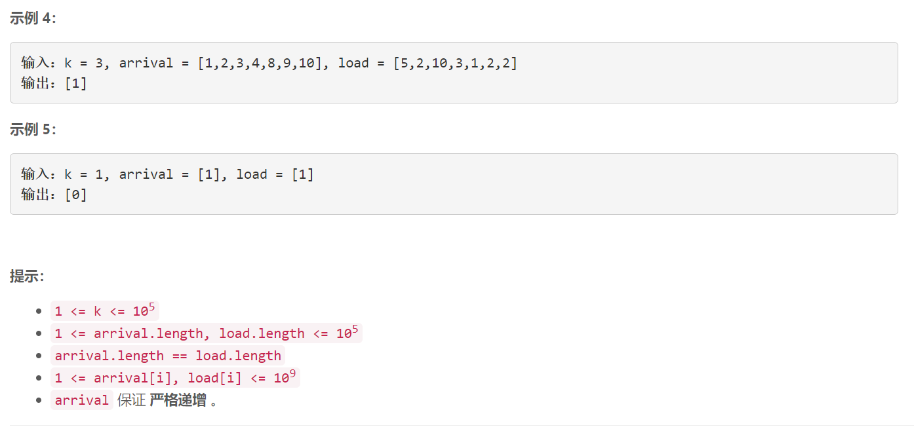

### 1606. 找到处理最多请求的服务器


  

    



## Java solution

```java
/*
class Solution {
    
    public List<Integer> busiestServers(int k, int[] arrival, int[] load) {
        TreeSet<Server> s=new TreeSet<>();
        int[] dp=new int[k];
        for(int i=0;i<k;i++)
        {
            s.add(new Server(0,i));
        }
        
        for(int i=0;i<arrival.length;i++)
        {
            //treemap是树形结构 因此调用ceiling函数时 先调用
            // r.compareTo(root) 如果返回-1 则比较r.compareTo(root.right) 返回1 则比较r.compareTo(root.left) 这里面对用例
            //3 [2,6,7,8] [1,3,1,4]时 i=3会出现
            //     root(id=1 time=9)
            //left(id=0 time=3)    right(id=2 time=8)
            //这时需要的id是i%3=0 但是由于r.compareTo(root) 返回-1 则比较r.compareTo(root.right) 所以会错过left 因此无法通过
            Server r=new Server(arrival[i],i%k);
            Server cur=s.ceiling(r);
            if(cur!=null)
            {
                
                cur.time=arrival[i]+load[i];
                dp[cur.id]++;
                System.out.print("i:"+i+"\n");
                for(Server v:s)System.out.print(v.id+" "+v.time+"\n");
                continue;
            }
            cur=s.ceiling(new Server(arrival[i],0));
            if(cur!=null)
            {
                cur.time=arrival[i]+load[i];
                dp[cur.id]++;
               
                //System.out.print(arrival[i]+" "+cur.id+" "+i+"\n");
            }
            
        }
        int max=0;
        for(int i=0;i<k;i++)
        {
            max=Math.max(max,dp[i]);
        }
        List<Integer> res=new ArrayList<>();
        for(int i=0;i<k;i++)
        {
            if(dp[i]==max) res.add(i);
        }
        return res;
    }
     
}

class Server implements Comparable<Server> 
{
    int time;
    int id;
    public Server(int time,int id)
    {
        this.time=time;
        this.id=id;
    }
    @Override  
    public int compareTo(Server s) {  
         if(this.id<=s.id && this.time>=s.time) return -1;
         return 1;
    }  
}*/
class Solution
{
  public List<Integer> busiestServers(int k, int[] arrival, int[] load) {
        PriorityQueue<Server> busy=new PriorityQueue<>();
        TreeSet<Integer> free=new TreeSet<>();
        int[] dp=new int[k];
        for(int i=0;i<k;i++) free.add(i);
        for(int i=0;i<arrival.length;i++)
        {
           while(!busy.isEmpty() && busy.peek().time<=arrival[i])
           {
               free.add(busy.poll().id);
           }
           if(free.isEmpty()) continue;
           Integer cur=free.ceiling(i%k);
           if(cur==null)  cur=free.pollFirst();
           else {
              free.remove(cur);
           }
           //System.out.print(cur+" ");
           dp[cur]++;
           busy.offer(new Server(arrival[i]+load[i],cur)) ;
        }
        int max=0;
        for(int i=0;i<k;i++)
        {
            max=Math.max(max,dp[i]);
        }
        List<Integer> res=new ArrayList<>();
        for(int i=0;i<k;i++)
        {
            if(dp[i]==max) res.add(i);
        }
        return res;
    }
}

class Server implements Comparable<Server> 
{
    int time;
    int id;
    public Server(int time,int id)
    {
        this.time=time;
        this.id=id;
    }
    @Override  
    public int compareTo(Server s) {  
         if(this.time>=s.time) return 1;
         return -1;
    }  
}
```