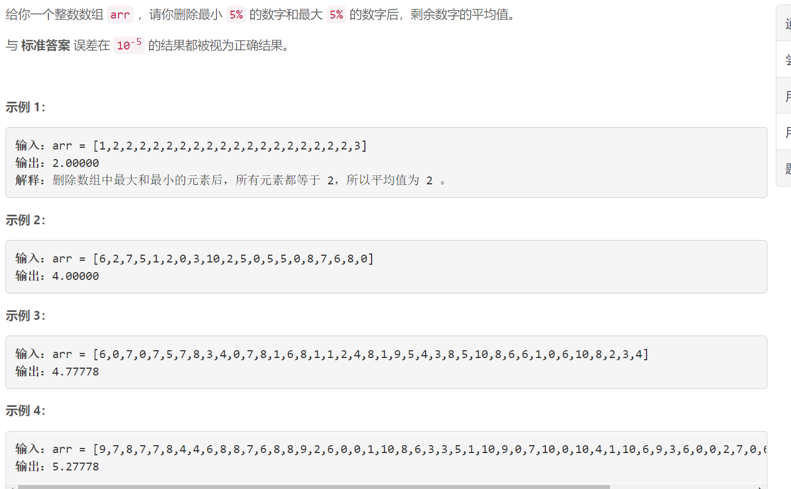
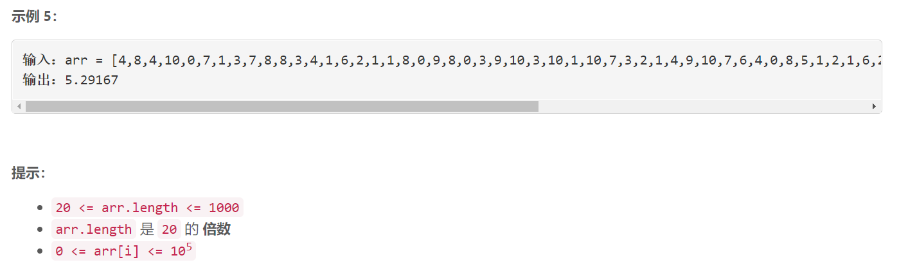

### 1619. 删除某些元素后的数组均值

### 



## Java solution

```java
class Solution {
    public double trimMean(int[] arr) {
      int n=arr.length;
      int l=(int)(n/20);
      Arrays.sort(arr);
      double res=0.0;  
      for(int i=l;i<n-l;i++) res+=(double)arr[i];
      return res/(n-2*l);  
    }
}
```


