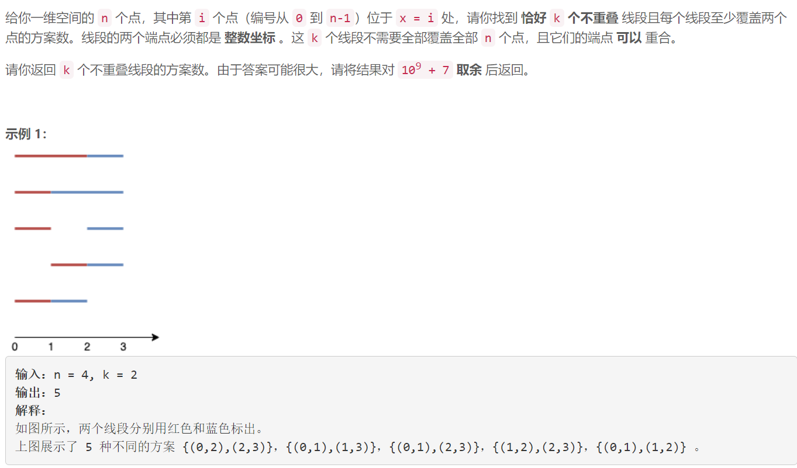
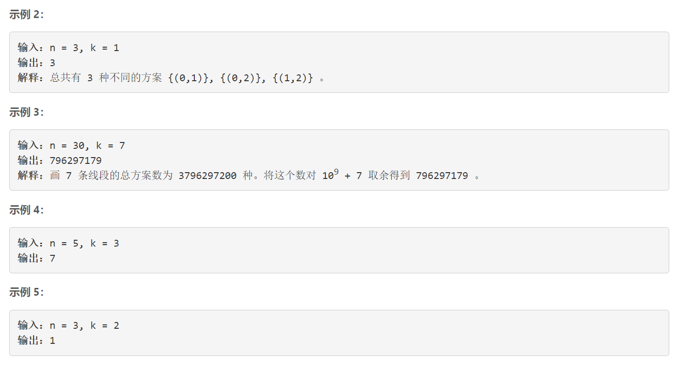
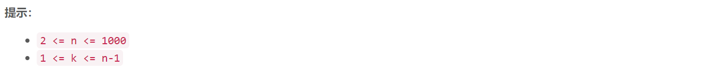

### 5527. 大小为 K 的不重叠线段的数目


    

  



## Java solution

```java
class Solution {
    long mod=(long)1E9+7;
    //排列组合方法 由于线段的端点可以重合 所以在两两线段之间添加一个点
    //这样就是在 n+k1个点中选k个线段 也就是2*k个端点
    /*
    public int numberOfSets(int n, int k) {
      return combine(n+k-1,2*k);
    }
    private int combine(int m,int n)
    {
        long[][] c=new long[m+1][n+1];
        for(int i=0;i<=m;i++)c[i][0]=1;
        for(int i=1;i<=m;i++)for(int j=1;j<=n;j++)
        {
            c[i][j]=(c[i-1][j-1]+c[i-1][j])%mod;
        }
        return (int)c[m][n];
    }*/
    //dp 解法
    long[][] dp=new long[1005][2];// dp[k][0] 表示给定线段数目 k条线段且线段最后一个位置不放线段 dp[k][1]放线段 n个点可以放n-1个线段
    public int numberOfSets(int n, int k) {
       dp[0][0]=1;  
       for(int i=1;i<n;i++)// n-1个线段
       {
           for(int j=k;j>=1;j--)
           {
              // 等号左边是当前位置 等号右边是前一个位置
              dp[j][0]=(dp[j][0]+dp[j][1])%mod;
              dp[j][1]=(dp[j][1]+dp[j-1][0]+dp[j-1][1])%mod;
           }
       }
       return (int)((dp[k][0]+dp[k][1])%mod);  
    }
}
```