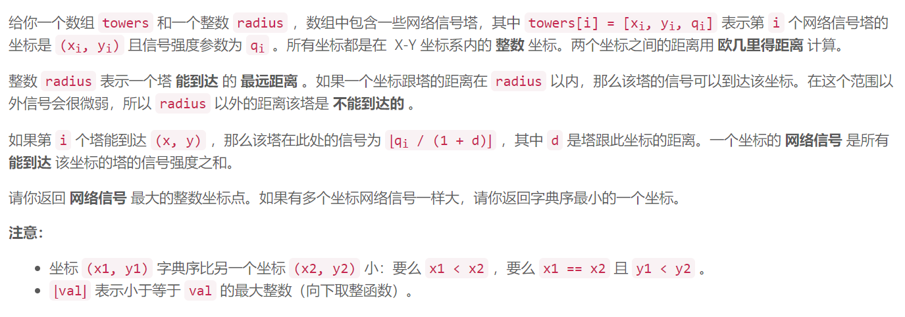

### 5528. 网络信号最好的坐标

  


## Java solution
```java
class Solution {
    public int[] bestCoordinate(int[][] towers, int radius) {
        int[][] dp=new int[55][55];
        int max=0;
        int[] res=new int[2];
        int r2=radius*radius;
        for(int x=0;x<=50;x++)for(int y=0;y<=50;y++)
        {
            for(int[] t:towers)
            {
                int dx=t[0]-x;
                int dy=t[1]-y;
                int sq=dx*dx+dy*dy;
                if(sq<=r2)
                {
                    dp[x][y]+=(int)(t[2]/(1+Math.sqrt(sq)));
                }
            }
            max=Math.max(max,dp[x][y]);
        }
        
        //if(max==81)System.out.print(max+" "+dp[32][31]+" "+dp[32][32]+"\n");
        for(int x=0;x<=50;x++)for(int y=0;y<=50;y++)
        {
            if(dp[x][y]==max)
            {
                res[0]=x;
                res[1]=y;
                return res;
            }
        }
        return res;
    }
}
```

