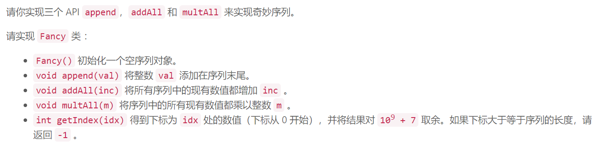
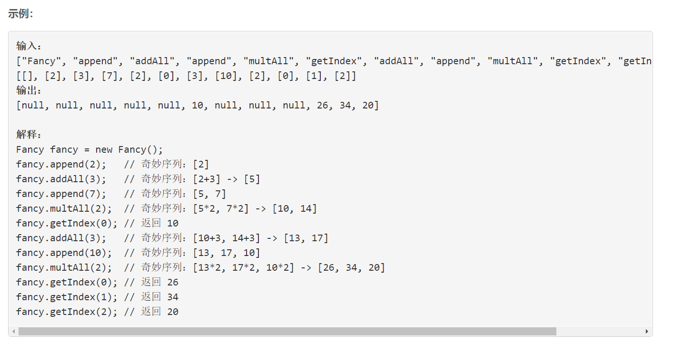
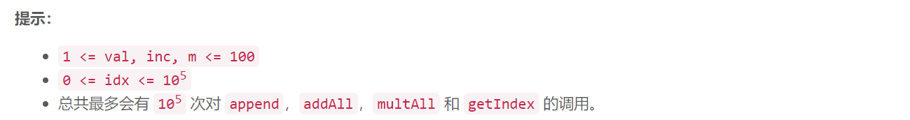

### 5530. 奇妙序列


  

    



## Java solution

```java
/*
class Fancy {
    //可以通过所有测试用例 但是还是超时
    long[] nums=new long[100005];
    Operator[] ops=new Operator[100005];
    int[] po=new int[100005];// po[nums_idx]  ops[0,po[nums_idx]) 仅作用于nums[0,,nums_idx]区间内操作数 那么ops开始作用于nums[nums_idx+1] 的索引就是po[nums_idx+1]
    long mod=(long)1e9+7; 
    int nums_idx;
    int op_idx;
    public Fancy() {
          nums_idx=0;
          op_idx=0;
    }
    
    public void append(int val) {
          nums[nums_idx]=(long)val;
          po[nums_idx]=nums_idx>0?po[nums_idx-1]:0;
          nums_idx++;
    }
    
    public void addAll(int inc) {
         ops[op_idx++]=new Operator('+',(long)inc);
         po[nums_idx-1]=op_idx;
    }
    
    public void multAll(int m) {
         ops[op_idx++]=new Operator('*',(long)m);
         po[nums_idx-1]=op_idx;
    }
    
    public int getIndex(int idx) {
         if(idx>=nums_idx) return -1;
         long res=nums[idx];
         int start=idx==0?0:po[idx-1];
         //System.out.print(start+" "+idx+"\n");
         for(int i=start;i<op_idx;i++)
         {
             Operator o=ops[i];
             //System.out.print(res+" "+o.op+" "+o.num+" "+o.idx+"\n");
             if(o.op=='+') res=(res+o.num)%mod;
             else if(o.op=='*') res=(res*o.num)%mod;
         }
         return (int)(res%mod);
    }
}

class Operator
{
    char op;
    long num;
    Operator(char op,long num)
    {
        this.op=op;
        this.num=num;
    }
    
}*/
/*
插入一个数后面的所有操作都可以化简 (a * x + b) * c + d = ac * x + (b * c + d)
所以我们可以记录 mult，add 的值，并每次有操作时更新这两个值
取值时就是 (x * mult + add) % mod

当新插入一个数 val 时, 此时已经记录的 mult, add, 假设我们能求一个数 x 使得
(x * mult + add) = val, 那么后续取这个值时就可以统一使用 mult，add 来取值了
如何求 x 呢？
x * mult = val - add, (% m)
x = (val - add) * inv(mult)
其中 inv(mult),是 mult 的乘法逆元，满足， (inv(mult) * mult) % mod = 1
*/
class Fancy {
    long mod=(long)1e9+7; 
    List<Long> nums;
    long mult;
    long add;
    public Fancy() {
          nums=new ArrayList<>();
          mult=1;
          add=0;
    }
    
    public void append(int val) {
        long v=((((long)val-add+mod)%mod) * inv(mult)) %mod;
        nums.add(v);
    }
    
    public void addAll(int inc) {
        add=(add+(long)inc)%mod;
    }
    
    public void multAll(int m) {
        add=(add*(long)m)%mod;
        mult=(mult*(long)m)%mod;
    }
    
    public int getIndex(int idx) {
        if(idx<0 || idx>=nums.size()) return -1;
        return (int)((((nums.get(idx)*mult)%mod) + add) %mod) ;
    }
    // 快速幂  a^b
    private long quickMul(long a,long b)
    {
       long res=1;
       while(b!=0)
       {
           if((b&1)>0) res=(res*a)%mod;
           a=(a*a)%mod;
           b>>=1;
       }
       return res;
    }
    private long inv(long a)
    {
        return quickMul(a,mod-2);
    }
}


/**
 * Your Fancy object will be instantiated and called as such:
 * Fancy obj = new Fancy();
 * obj.append(val);
 * obj.addAll(inc);
 * obj.multAll(m);
 * int param_4 = obj.getIndex(idx);
 */
```