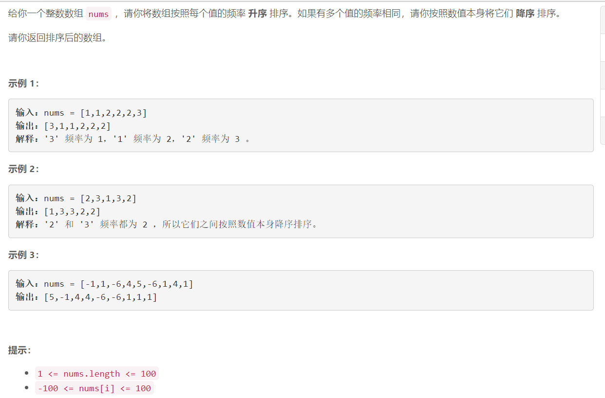

### 5539. 按照频率将数组升序排序

### 

## Java solution

```java
class Solution {
    public int[] frequencySort(int[] nums) {
        int[] dp=new int[205];
        for(int i=0;i<nums.length;i++) dp[nums[i]+100]++;
        List<Num> l=new ArrayList<>();
        for(int i=0;i<205;i++) if(dp[i]!=0)
        {
            l.add(new Num(dp[i],i-100));
        }
        Collections.sort(l);
        int[] res=new int[nums.length];
        for(int i=0,k=0;i<l.size();i++)
        {
           for(int j=0;j<l.get(i).cnt;j++) res[k++]=l.get(i).n;
        }
        return res;
    }
}

class Num  implements Comparable<Num>
{
   int cnt;
   int n;
   Num(int cnt,int n)
   {
       this.cnt=cnt;
       this.n=n;
   }
   @Override 
   public int compareTo(Num o)
   {
       return o.cnt!=this.cnt?this.cnt-o.cnt:o.n-this.n;
   }
}
```


