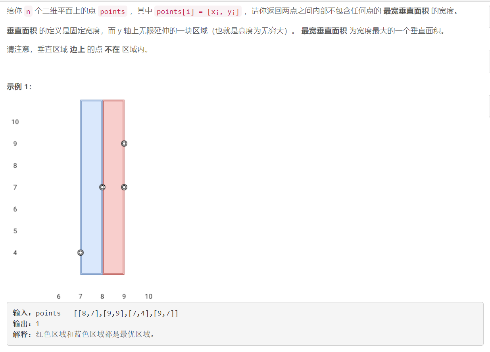
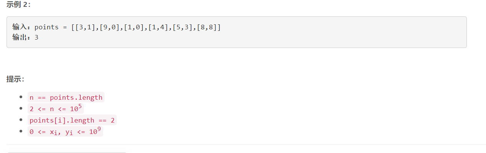

### 5540. 两点之间不包含任何点的最宽垂直面积


    

  

## Java solution

```java
class Solution {
    public int maxWidthOfVerticalArea(int[][] points) {
           Arrays.sort(points,(a,b)->a[0]-b[0]);
           int res=0;
           for(int i=1;i<points.length;i++) res=Math.max(res,points[i][0]-points[i-1][0]);
           return res;
    }
}
```