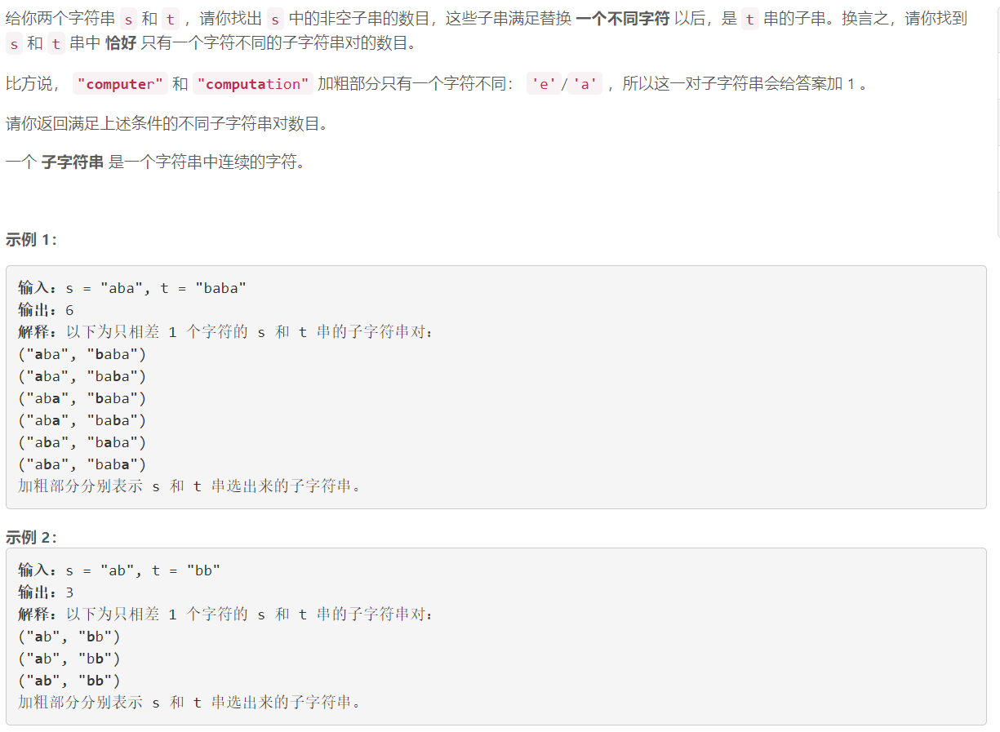
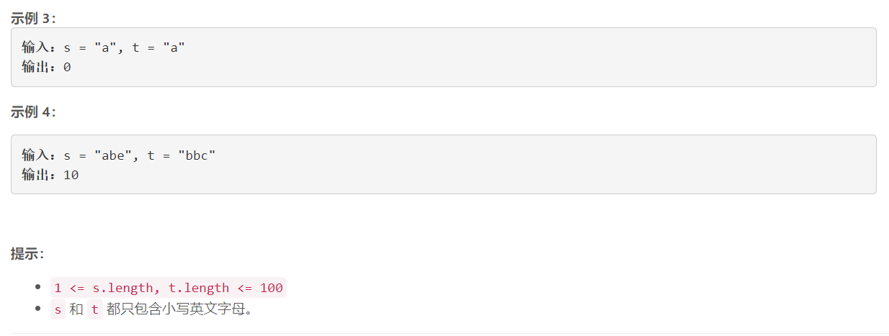

### 5541. 统计只差一个字符的子串数目

  




## Java solution
```java
class Solution {
    public int countSubstrings(String s, String t) {
        int res=0;
        boolean[][][] dp=new boolean[105][105][105];// dp[i][j][k] 表示 s[i,i+k] 和t[j][j+k] 匹配
        int n1=s.length();
        int n2=t.length();
        for(int i=0;i<n1;i++) for(int j=0;j<n2;j++) for(int k=0;k+i<n1 && k+j<n2 && s.charAt(k+i)==t.charAt(k+j);k++)
        {
            dp[i][j][k+1]=true;
        }
        
        for(int i=0;i<n1;i++) for(int j=0;j<n2;j++) for(int k=1;k+i<=n1 && k+j<=n2;k++)
        {
            if(k==1 && !dp[i][j][k]) res++;
            else
            {
               if(dp[i][j][k] && j>0 && i>0 && s.charAt(i-1)!=t.charAt(j-1)) res++;
               if(dp[i][j][k] && j+k<n2 && i+k<n1 && s.charAt(i+k)!=t.charAt(j+k)) 
               {
                   res++;
                   for(int l=1;j+k+l<=n2 && i+k+l<=n1 && dp[i+k+1][j+k+1][l];l++) 
                   {
                       //System.out.print(i+" "+j+" "+k+"\n");
                       res++;
                   }
               }
            }
        }

        return res;
    }
}
```

