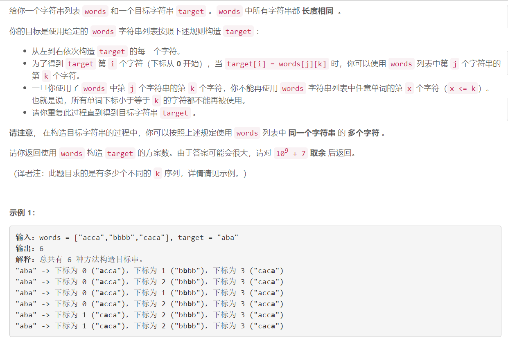
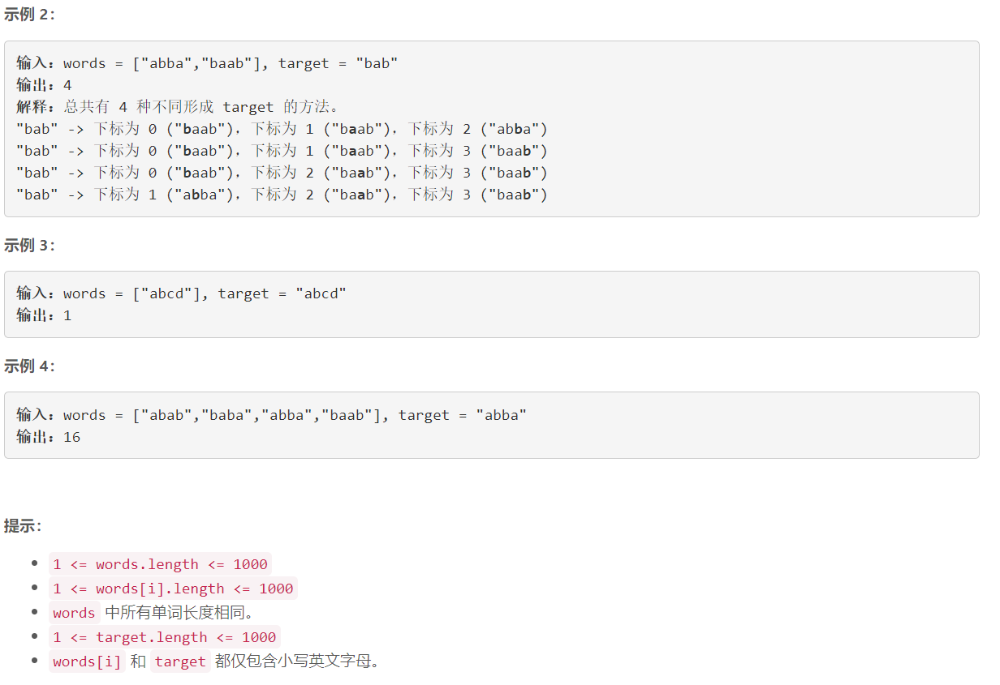

### 5542. 通过给定词典构造目标字符串的方案数


  

    

## Java solution

```java
class Solution {
    long mod=(long)(1e9)+7;
    public int numWays(String[] words, String target) {
         int n1=target.length(),n2=words[0].length();
         long[][] dp=new long[n1+5][n2+5];  // dp[i][j] target[i] 最多使用words中单词j个单词的方案数
         long[][] cnt=new long[n2+5][26]; // cnt[i]['a'-'a'] 表示words所有单词在索引i位置上a的数目
         for(int i=0;i<=n2;i++) dp[0][i]=1;
         for(String w:words)for(int i=0;i<n2;i++) cnt[i][(int)(w.charAt(i)-'a')]++;
         for(int i=1;i<=n1;i++)
         {
             for(int j=i;j<=n2;j++) dp[i][j]=(dp[i][j]+dp[i-1][j-1]*cnt[j-1][(int)(target.charAt(i-1)-'a')])%mod;
             for(int j=1;j<=n2;j++) dp[i][j]=(dp[i][j]+dp[i][j-1])%mod;
         }
         
         return (int)dp[n1][n2];
    }
}
```