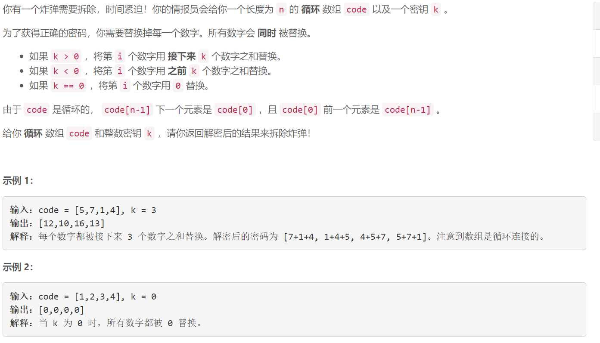

### 5550. 拆炸弹

### 

## Java solution

```java
class Solution {
    public int[] decrypt(int[] code, int k) {
         int n=code.length;
         int[] res=new int[n];
         if(k>0)
         {
            for(int i=0;i<n;i++)
            {
                for(int j=1;j<=k;j++)
                {
                    int c=(i+j)%n;
                    res[i]+=code[c];
                }
            }
         }
        else if(k<0)
        {
            for(int i=0;i<n;i++)
            for(int j=k;j<0;j++)
            {
                int c=(i+j+n)%n;
                res[i]+=code[c];
            }
        }
        return res;
            
    }
}
```


