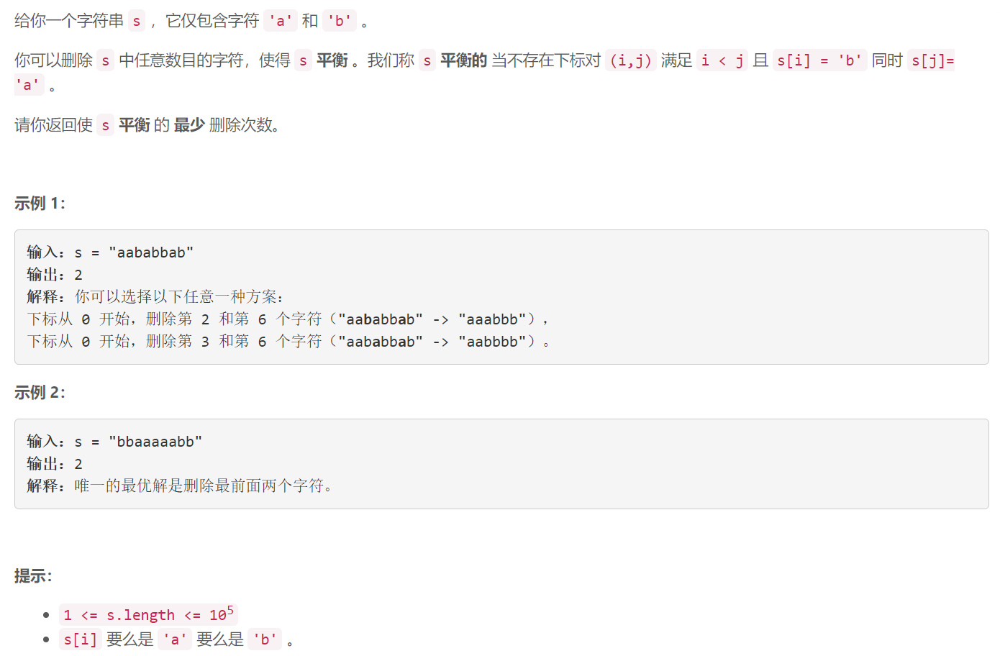

### 5551. 使字符串平衡的最少删除次数


    

  

## Java solution

```java
class Solution {
    public int minimumDeletions(String s) {
         int n=s.length();
         char[] c=s.toCharArray();
         int[] dp1=new int[n];
         int[] dp2=new int[n];
         dp1[0]=c[0]=='b'?1:0;
         dp2[n-1]=c[n-1]=='a'?1:0;
         for(int i=1;i<n;i++)
         {
             dp1[i]=dp1[i-1]+(c[i]=='b'?1:0);
         }
         for(int i=n-2;i>=0;i--)
         {
             dp2[i]=dp2[i+1]+(c[i]=='a'?1:0);
         }
         int res=n;
         for(int i=0;i<n;i++)
         {
             res=Math.min(res,dp1[i]+dp2[i]-1);
         }
        
         return res;
    }
}
```