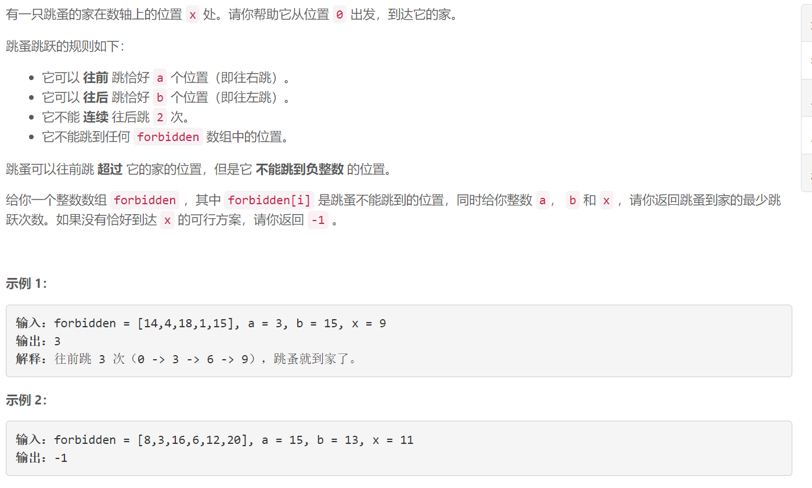
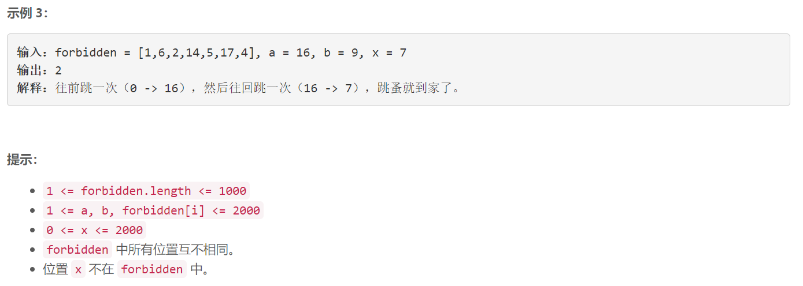

### 5552. 到家的最少跳跃次数

  




## Java solution
```java
class Solution {
    public int minimumJumps(int[] forbidden, int a, int b, int x) {
        if(x==0) return 0;
        int m=100000+5;
         boolean[] f=new boolean[m];
         for(int i:forbidden) f[i]=true;
         int[][] d=new int[m][2];// d[x][0] 位置x是向前跳到达 d[x][1] 位置x是向后跳到达
         for(int i=0;i<m;i++) Arrays.fill(d[i],-1);
         Queue<int[]> q=new LinkedList<>();
         q.offer(new int[]{0,0});  
         d[0][0]=0;
         while(!q.isEmpty())
         {
             int[] c=q.poll();
             int p1=c[0]+a;
             int p2=c[0]-b;
             int dist=d[c[0]][c[1]]+1;
             if( p1>=0 && p1<m && !f[p1] && d[p1][0]==-1)
             {
                 if(p1==x) return dist;
                 d[p1][0]=dist;
                 q.offer(new int[]{p1,0});
             }
             if(p2>=0  && p2<m && !f[p2] && c[1]==0  && d[p2][1]==-1)
             {
                 if(p2==x) return dist;
                  d[p2][1]=dist;
                 q.offer(new int[]{p2,1});
             }
         }
         return -1;
    }
}
```

