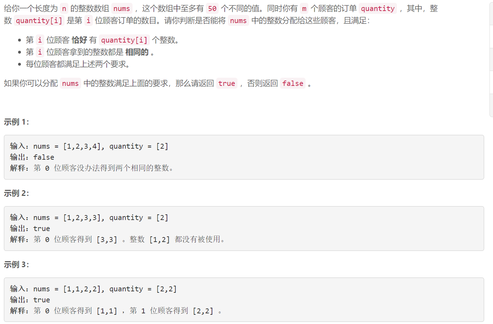
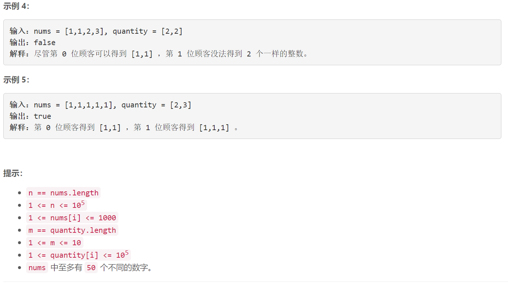

### 5553. 分配重复整数


  

    

## Java solution

```java
class Solution {
    public boolean canDistribute(int[] nums, int[] quantity) {
        boolean[][] dp=new boolean[55][1024];// dp[i][state] 最多使用i个不同的数字 能否满足状态state state的第j位表示第j位顾客是否被满足(=1--满足)
        int[] cnt=new int[55];//不同数字对应的出现次数 注意cnt是从1 开始的
        int[] sum=new int[1024]; // sum[state] 表示满足状态state所需的整数个数
        int[] c=new int[1005];
        for(int i:nums) c[i]++;
        int n=0;
        for(int i=0;i<1005;i++)if(c[i]>0) cnt[++n]=c[i];
        int m=quantity.length;
        for(int i=0;i<(1<<m);i++) for(int j=0;j<m;j++) if(((i>>j)&1)>0) sum[i]+=quantity[j];
        dp[0][0]=true;
        for(int i=1;i<=n;i++)for(int j=0;j<(1<<m);j++)
        {
            dp[i][j]=dp[i-1][j];
            for(int k=j;k>0&& !dp[i][j];k=(k-1)&j) // 这里状态K一定是j的一个子集
            {  
                //状态k下所需的数字数 小于第i个数字的个数 说明第i个数字可以满足状态k
                if(sum[k]<=cnt[i] && dp[i-1][j-k]) { dp[i][j]=true;} 
            }
        }
        return dp[n][(1<<m)-1];
    }
}
```