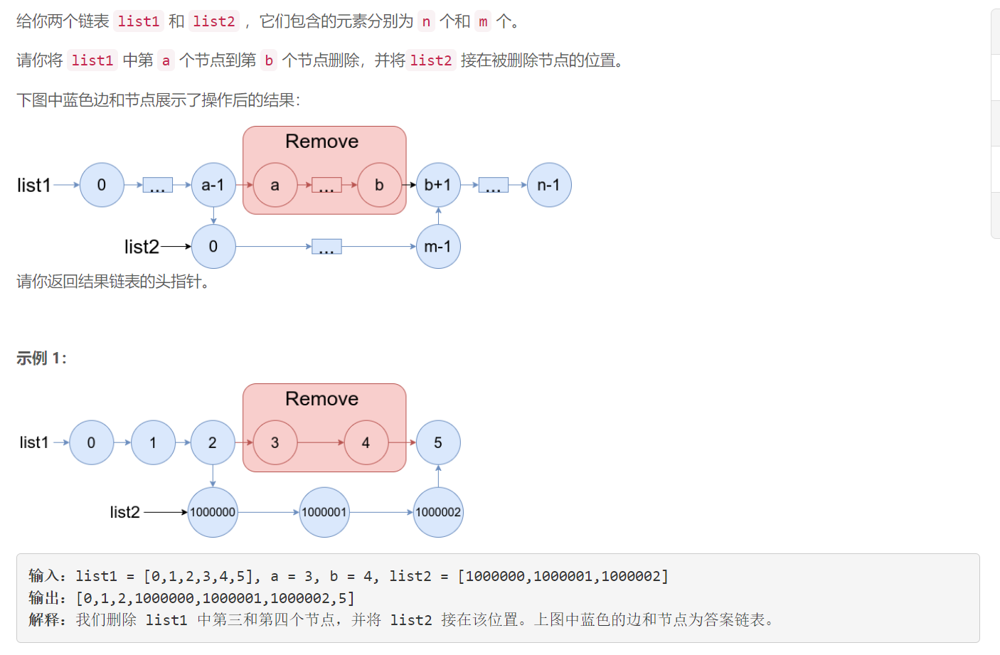
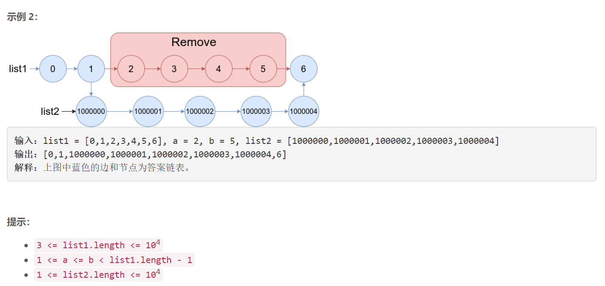

### 5558. 合并两个链表

### 



## Java solution

```java
/**
 * Definition for singly-linked list.
 * public class ListNode {
 *     int val;
 *     ListNode next;
 *     ListNode() {}
 *     ListNode(int val) { this.val = val; }
 *     ListNode(int val, ListNode next) { this.val = val; this.next = next; }
 * }
 */
class Solution {
    public ListNode mergeInBetween(ListNode list1, int a, int b, ListNode list2) {
        ListNode na=list1,nb=list1;
        for(int i=1;i<a;i++) na=na.next;
        for(int i=0;i<=b;i++) nb=nb.next;
        na.next=list2;
        while(list2.next!=null)list2=list2.next;
        list2.next=nb;
        return list1;
    }
}
```


