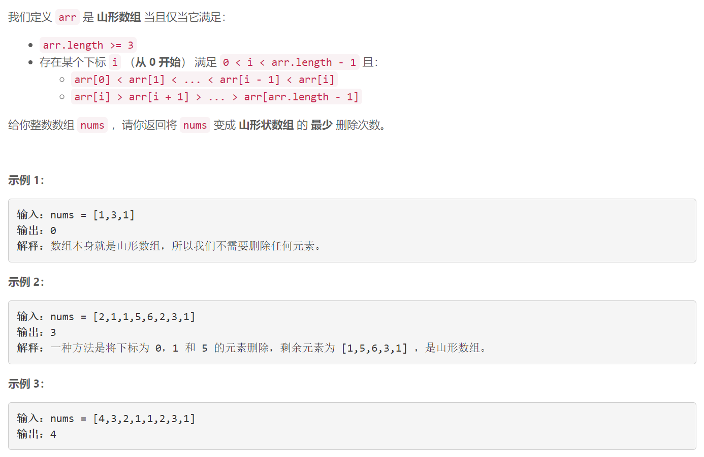
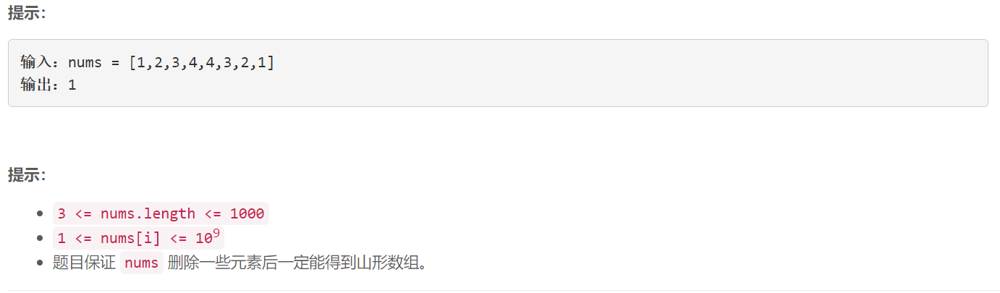

### 5559. 得到山形数组的最少删除次数


  

    

## Java solution

```java
class Solution {
    public int minimumMountainRemovals(int[] nums) {
       int n=nums.length; 
       int[] dp1=new int[n];// dp1[i] 表示[0,i]范围内最长上升子序列长度
       int[] dp2=new int[n];// dp2[i] 表示[i,n-1]范围内最长下降子序列长度
       for(int i=1;i<n-1;i++) dp1[i]= lengthOfLIS(nums,0,i,true) ;
        for(int i=n-2;i>0;i--)dp2[i]=lengthOfLIS(nums,i,n-1,false) ;
        int len=0;
        for(int i=1;i<n-1;i++) len=Math.max(len,dp1[i]+dp2[i]-1);
        return n-len;
    }
    public int lengthOfLIS(int[] nums,int start,int end,boolean flag) {
       int res=0,n=end-start+1,size=0; 
       int[] tails=new int[n];//每个元素 tails[k]的值代表 长度为 k+1的子序列尾部元素的值 保证它最小
       if(flag)for(int k=start;k<=end;k++)  //搜索目标是找到长度最长的k+1 同时tails[k]>num 更新tails[k]
       {
           int num=nums[k];
           int i=0,j=size;
           while(i<j)
           {
               int m=i+(j-i)/2;
               if(tails[m]<num)i=m+1;
               else j=m;
           }
           tails[i]=num;
           if(i==size)size++;//找不到tails[k]>num 说明最长的子序列可以加一个num 长度+1
       }
       else for(int k=end;k>=start;k--)
       {
           int num=nums[k];
           int i=0,j=size;
           while(i<j)
           {
               int m=i+(j-i)/2;
               if(tails[m]<num)i=m+1;
               else j=m;
           }
           tails[i]=num;
           if(i==size)size++;
       }
       return size;
    }
}
```