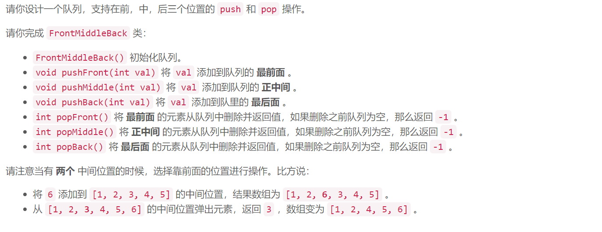

### 5560. 设计前中后队列

  


## Java solution
```java
class FrontMiddleBackQueue {
    Deque<Integer> q1;
    Deque<Integer> q2;
    public FrontMiddleBackQueue() {
        q1=new ArrayDeque<>();
        q2=new ArrayDeque<>();
    }
    
    public void pushFront(int val) {
        q1.offerFirst(val);
        adjust();
    }
    
    public void pushMiddle(int val) {
        if(q2.size()==q1.size())q2.offerFirst(val);
        else q1.offerLast(val);
        adjust();
    }
    
    public void pushBack(int val) {
        q2.offerLast(val);
        adjust();
    }
    
    public int popFront() {
        int res=-1;
        if(q1.isEmpty() && !q2.isEmpty()) res=q2.pollFirst();
        else if(!q1.isEmpty() && !q2.isEmpty()) res=q1.pollFirst();
        adjust();
        return res;
    }
    
    public int popMiddle() {
        int res=-1;
        if(q1.isEmpty() && !q2.isEmpty()) res=q2.pollFirst();
        else if(!q1.isEmpty() && !q2.isEmpty()) 
        {
            if(q2.size()==q1.size()) res=q1.pollLast();
            else res=q2.pollFirst();
        }
        adjust();
        return res;
    }
    
    public int popBack() {
         int res=-1;
         if(!q2.isEmpty()) res=q2.pollLast();
         adjust();
         return res;
    }
    private void adjust()
    {
        if(q2.size()<q1.size())
        {
            q2.offerFirst(q1.pollLast());
        }
        else if(q2.size()-q1.size()>1)
        {
            q1.offerLast(q2.pollFirst());
        }
    }
}

/**
 * Your FrontMiddleBackQueue object will be instantiated and called as such:
 * FrontMiddleBackQueue obj = new FrontMiddleBackQueue();
 * obj.pushFront(val);
 * obj.pushMiddle(val);
 * obj.pushBack(val);
 * int param_4 = obj.popFront();
 * int param_5 = obj.popMiddle();
 * int param_6 = obj.popBack();
 */
```

