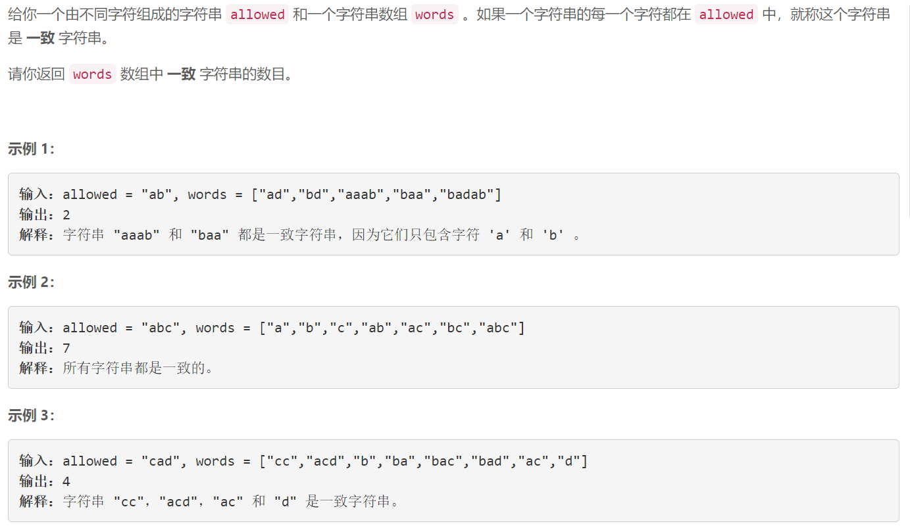

### 5609. 统计一致字符串的数目


    

  

## Java solution

```java
class Solution {
    public int countConsistentStrings(String allowed, String[] words) {
         boolean[] dp=new boolean[26];
         for(char c:allowed.toCharArray())dp[(int)(c-'a')]=true;
        int cnt=0;
        for(String s:words)
        {
            boolean flag=true;
            for(char c:s.toCharArray())
            {
                if(!dp[(int)(c-'a')])
                {
                    flag=false;
                    break;
                }
                
            }
            if(flag)cnt++;
        }
        return cnt;
    }
}
```