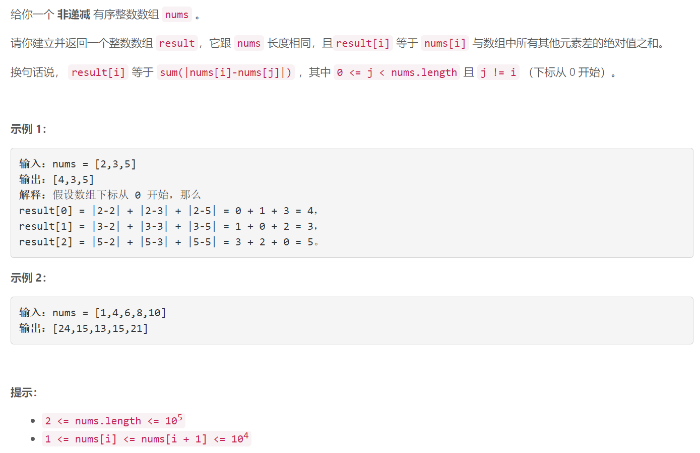

### 5610. 有序数组中差绝对值之和

### 

## Java solution

```java
class Solution {
    public int[] getSumAbsoluteDifferences(int[] nums) {
       int n=nums.length; 
       int[] dp1=new int[n];
        int[] dp2=new int[n];
        dp1[0]=nums[0];
        dp2[n-1]=nums[n-1];
        for(int i=1;i<n;i++) dp1[i]=dp1[i-1]+nums[i];
        for(int i=n-2;i>=0;i--) dp2[i]=dp2[i+1]+nums[i];
        int[] res=new int[n];
        for(int i=0;i<n;i++)
        {
            int l=i+1;
            int r=n-i;
            res[i]=l*nums[i]-dp1[i]+dp2[i]-r*nums[i];
        }
        return res;
    }
}
```


