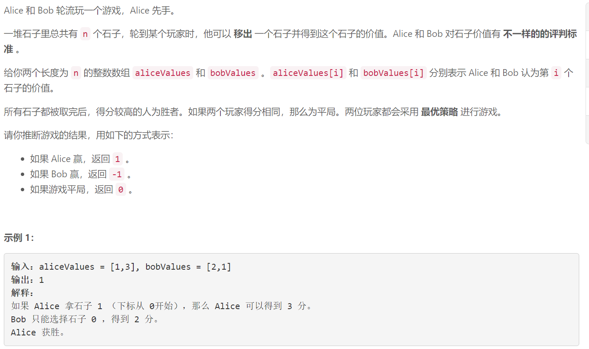
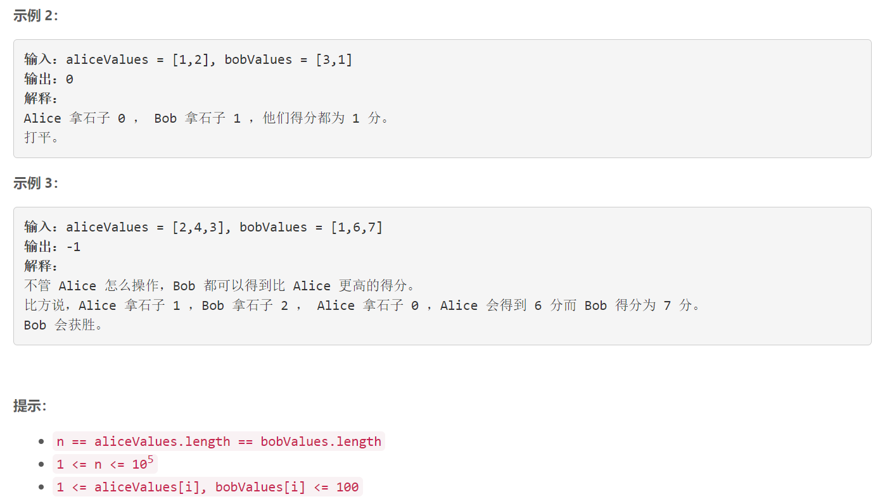

### 5611. 石子游戏 VI


  

    

## Java solution

```java
class Solution {
    public int stoneGameVI(int[] aliceValues, int[] bobValues) {
        int n=aliceValues.length;
        List<int[]> l=new ArrayList<>();
        // alice选择aliceValues[i] 那么bob就损失bobValues[i] 对于alice相对于bob多了aliceValues[i]+bobValues[i]
        //对于双方来说 目标都是使自己相对于对方大的更多 也就是aliceValues[i]+bobValues[i]更大
        for(int i=0;i<n;i++)
        {
            l.add(new int[]{aliceValues[i]+bobValues[i],aliceValues[i],bobValues[i]});
        }
        Collections.sort(l,(a,b)->b[0]-a[0]);
        int suma=0,sumb=0;
        for(int i=0;i<n;i++) 
        {
            if(i%2==0) suma+=l.get(i)[1];
            else sumb+=l.get(i)[2];
        }
        if(suma>sumb) return 1;
        if(suma<sumb) return -1;
        return 0;
    }
}
```