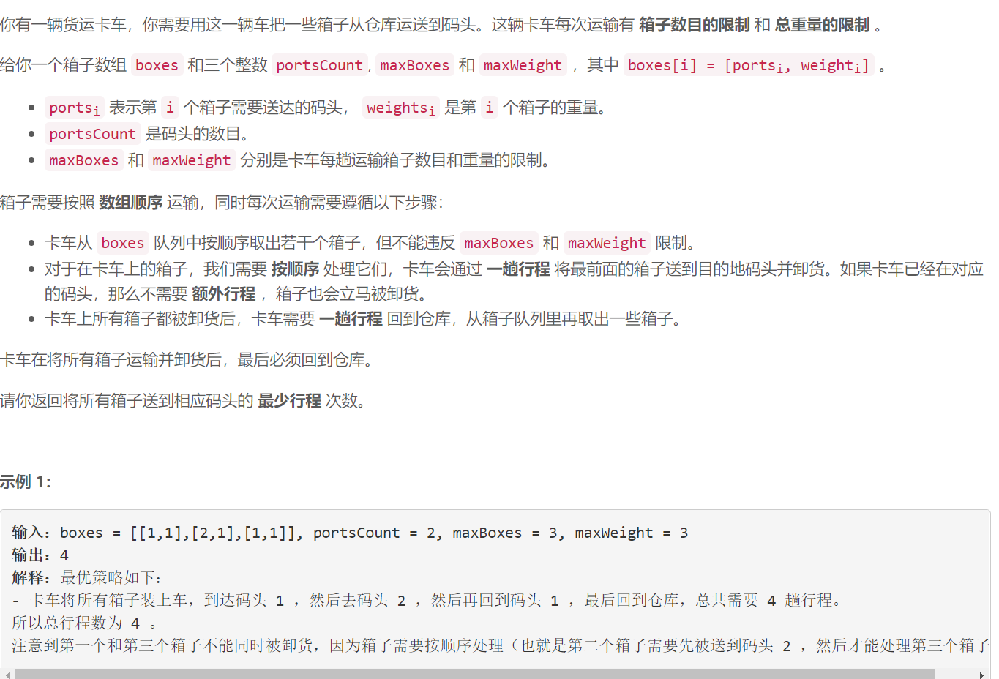
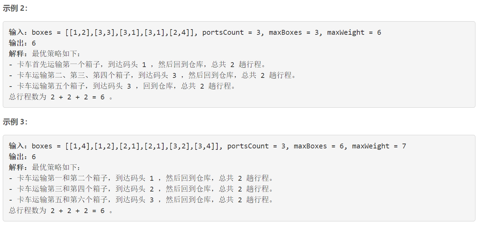
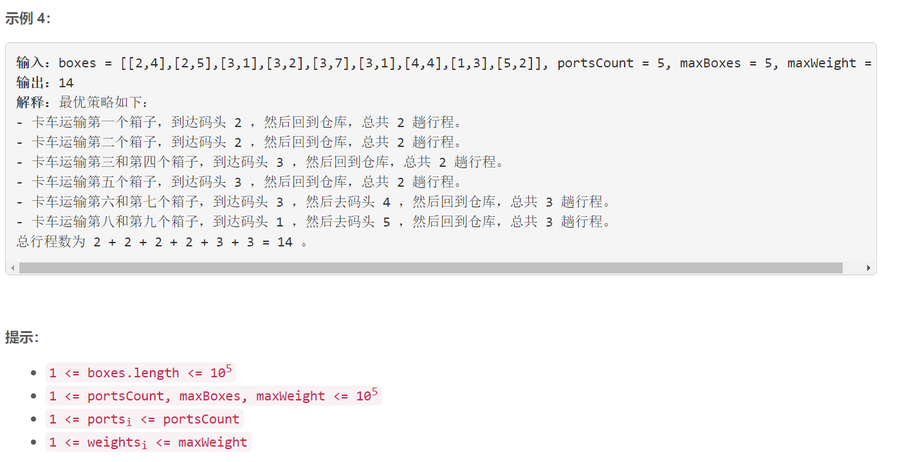

### 5612. 从仓库到码头运输箱子

  





题解:https://leetcode-cn.com/problems/delivering-boxes-from-storage-to-ports/solution/cong-cang-ku-dao-ma-tou-yun-shu-xiang-zi-dqnq/

## Java solution

```java
public static int boxDelivering(int[][] boxes, int portsCount, int maxBoxes, int maxWeight) {
        int n = boxes.length;
        int[] p = new int[n+1];
        int[] w = new int[n+1];
        int[] neg = new int[n+1];
        int[] W = new int[n+1];
        for (int i = 1; i <= n; i++) {
            p[i] = boxes[i-1][0];//码头位置
            w[i] = boxes[i-1][1];//箱子重量
            if(i > 1){
                neg[i] = neg[i-1] + (p[i-1] != p[i] ? 1 : 0);
            }
            W[i] = W[i-1] + w[i];
        }

        int[] f = new int[n + 1];
        int[] g = new int[n + 1];

        Deque<Integer> opt = new LinkedList<>();
        opt.offer(0); //将g的索引添加进来

        for (int i = 1; i <= n; i++) {
            while(!opt.isEmpty() && (i - opt.peekFirst() > maxBoxes || (W[i] - W[opt.peekFirst()]) > maxWeight)){
                opt.pollFirst();
            }
            f[i] = g[opt.peekFirst()] + neg[i] + 2; //加入当前元素
            if(i != n){
                g[i] = f[i] - neg[i + 1];
                 // g是一个单调队列(从小到大递增) 那么i在进入队列之前 先弹出比g[i]大的索引
                // 每次f[i]计算只需要满足约束g[j]的最小值 那么如果j位置不满足约束 j之前的位置也不可能满足约束--也就是在这里弹出的索引
                //因为i-j和 W[i]-W[j]是递增的
                while (!opt.isEmpty() && g[i] < g[opt.peekLast()]) {
                    opt.pollLast();
                }
                opt.offer(i);
            }

        }
        return f[n];
    }
}
```

